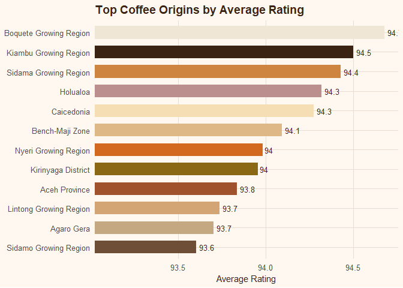
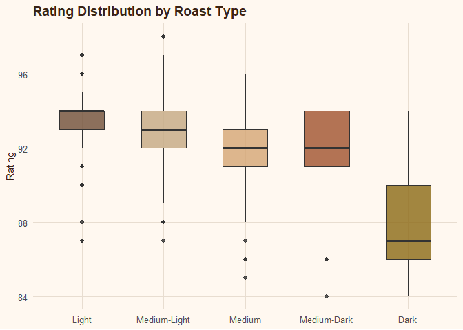
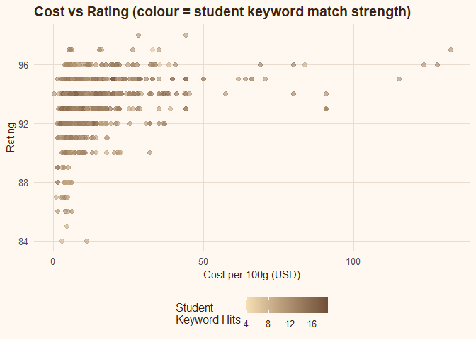
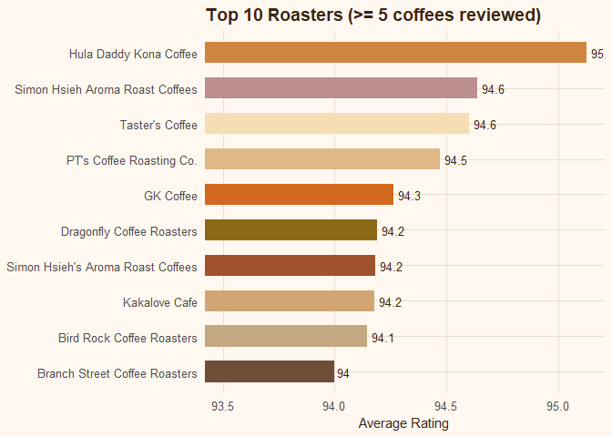
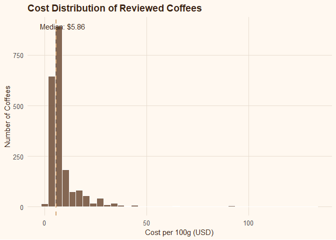

# Purpose

This is the solution for the **Coffee Hub** analysis. The brief is to
take the raw coffee-review data, clean it, engineer a few useful
variables, and then profile the collection of reviewed coffees across
seven angles (origin, roast, value, roaster, student taste-match, cost
and location). The approach is:

- Build a loader function that reads the CSV, fixes the Excel/UTF-8
  encoding issues, drops incomplete records, and engineers the helper
  variables (a Rand cost and a single merged review string).
- Score every coffee against the Stellenbosch student word-cloud
  preferences.
- Summarise the seven key factors and visualise the most important of
  them.

<!-- -->

    ##           used (Mb) gc trigger (Mb) max used (Mb)
    ## Ncells  562873 30.1    1256284 67.1   703848 37.6
    ## Vcells 1065472  8.2    8388608 64.0  1932112 14.8

# 1. Loading the data

``` r
coffee <- load_coffee("data/Coffee/Coffee.csv")
# the load function firstly removes the encoding issues and then once its done i filter and remove any coffee item that has missing values or an NA in the observables.

# I also create a Cost variable in Rands using the exchange rate as of June 17th 2026 which was R16.17.
# lastly, i also merger the 3 reviewers feedback into 1 long review.
```

**What this step does and why it matters.** The raw file is exported
from Excel, so accented origin/roaster names (e.g. *Café*, *Bogotá*)
arrive as broken UTF-8. `load_coffee()` transliterates everything to
plain ASCII (`Latin-ASCII`) so the text is safe to match and print, then
removes any coffee missing a roast type or any of the three reviewer
descriptions — these are the fields every downstream summary depends on,
so keeping incomplete rows would bias the averages. Two engineered
columns are added: `Cost_rands` (USD × 16.17, the 17 June 2026 rate) to
express price in local terms, and `desc_all`, which concatenates the
three reviewer notes into one searchable string for keyword scoring.

## KEYWORD MATCHING — Stellenbosch student word-cloud preferences

``` r
# This is the top words from the Stellenbosch survey that were given in the word bubble within the key words.
# The objective is to use the how many of the reviews hit or use the same words as in the ones that were top from the survey.


student_keywords <- c(
    "sweet", "chocolate", "aroma", "mouthfeel", "finish", "structure",
    "toned", "notes", "bright", "fruit", "rich", "floral", "balanced",
    "crisp", "spice", "dark", "roasted", "cocoa", "cup", "syrupy",
    "smooth", "honey", "berry", "citrus", "caramel", "vanilla", "nutty",
    "almond", "cherry"
)


coffee <- flag_keyword_matches(coffee, student_keywords) # this creates the variable kw_hits which how many of the keywords from the survey from stellenbosch were included in the reviews.

head(coffee)
```

    ## # A tibble: 6 × 16
    ##   name          roaster roast loc_country origin_1 origin_2 Cost_Per_100g Rating
    ##   <chr>         <chr>   <chr> <chr>       <chr>    <chr>            <dbl>  <dbl>
    ## 1 "\"Sweety\" … A.R.C.  Medi… Hong Kong   Panama   Ethiopia         14.3      95
    ## 2 "Flora Blend… A.R.C.  Medi… Hong Kong   Africa   Asia Pa…          9.05     94
    ## 3 "Ethiopia Sh… Revel … Medi… United Sta… Guji Zo… Souther…          4.7      92
    ## 4 "Ethiopia Su… Roast … Medi… United Sta… Guji Zo… Oromia …          4.19     92
    ## 5 "Ethiopia Ge… Big Cr… Medi… United Sta… Gedeb D… Gedeo Z…          4.85     94
    ## 6 "Ethiopia Ka… Red Ro… Light United Sta… Odo Sha… Guji Zo…          5.14     93
    ## # ℹ 8 more variables: review_date <chr>, desc_1 <chr>, desc_2 <chr>,
    ## #   desc_3 <chr>, Cost_rands <dbl>, desc_all <chr>, kw_hits <int>,
    ## #   student_match <lgl>

**Interpreting the keyword match.** Each coffee’s merged review is
scanned for the 29 flavour words that Stellenbosch students ranked
highest in the survey word-cloud. `kw_hits` counts how many distinct
preference words appear, and `student_match` flags any coffee at or
above the median hit count — i.e. the coffees whose tasting notes “speak
the students’ language”. A higher `kw_hits` does not mean a better
coffee; it means the review vocabulary overlaps more with what the
target market actually says it wants, which is what makes a coffee a
good candidate to stock for that audience.

# Analysis

Here I analyse 7 key factors, ranking the coffees by the variable of
interest in each case. The summaries below feed directly into the
visuals that follow.

``` r
# here i use the analyse functions for create variables that will be sueed for summary stats
origins        <- top_origins(coffee)
roast_stats    <- rating_by_roast(coffee)
value_coffees  <- best_value(coffee)
roasters       <- top_roasters(coffee)
student_picks  <- student_top_picks(coffee)
cost_stats     <- cost_summary(coffee)
locations      <- roaster_locations(coffee)
```

Each object isolates one decision-relevant question: which **origins**
and **roasters** consistently score well (with a minimum-count filter so
a single lucky review can’t top the table), which roast levels the
reviewers prefer, where the **best value** lies (rating earned per
dollar), which coffees best fit **student** taste, and how **cost** is
distributed overall and by roast.

# Visuals

``` r
# ── Plot 1: Top Origins ──────────────────────────────────────────────────
 origins %>%
    mutate(origin_1 = fct_reorder(origin_1, avg_rating)) %>%
    ggplot(aes(x = avg_rating, y = origin_1, fill = origin_1)) +
    geom_col(show.legend = FALSE, width = 0.65) +
    geom_text(aes(label = round(avg_rating, 1)),
              hjust = -0.2, size = 3.5, colour = "#3B2314") +
    scale_fill_manual(values = coffee_palette) +
    labs(
        title = "Top Coffee Origins by Average Rating",
        x = "Average Rating", y = NULL
    ) +
    coord_cartesian(xlim = c(min(origins$avg_rating) - 0.5, NA)) +
    theme_coffee()
```



**Plot 1 — Top origins.** The best-rated growing regions are dominated
by East Africa and a handful of premium single-origins: Panama’s
**Boquete** leads (~94.6), followed by Kenya’s **Kiambu** (94.5) and
Ethiopia’s **Sidama** (94.4), with Kenyan (Nyeri, Kirinyaga) and
Ethiopian (Bench-Maji, Agaro Gera, Sidamo) regions filling out most of
the table. The key takeaway is that **all twelve top origins sit in a
very narrow 93.6–94.6 band** — barely a single rating point apart.
Origin clearly signals quality (these are the classic high-altitude
specialty regions), but among the leaders the differences are small, so
origin alone is a weak way to separate the top coffees from one another.

``` r
# ── Plot 2: Rating by Roast (boxplot) ────────────────────────────────────
roast_order <- roast_stats %>% pull(roast)

coffee %>%
    mutate(roast = factor(roast, levels = roast_order)) %>%
    ggplot(aes(x = roast, y = Rating, fill = roast)) +
    geom_boxplot(alpha = 0.8, show.legend = FALSE, width = 0.55) +
    scale_fill_manual(values = coffee_palette) +
    labs(
        title = "Rating Distribution by Roast Type",
        x = NULL, y = "Rating"
    ) +
    theme_coffee()
```



**Plot 2 — Rating by roast.** There is a clear, almost monotonic
pattern: **lighter roasts score higher**. Light and Medium-Light have
the highest medians (~93) and tight boxes, Medium and Medium-Dark sit
around 92, and **Dark roast is the clear laggard** — its median drops to
~87.5 *and* its spread is much wider, meaning dark roasts are both
lower-rated and less consistent. This fits specialty convention: lighter
roasts preserve the origin character the reviewers reward, whereas dark
roasting flattens those distinctions. Practically, the Coffee Hub should
lean towards light/medium-light roasts for the highest and most reliable
scores.

``` r
# ── Plot 3: Cost vs Rating (scatter, colour = keyword hits) ──────────────
 coffee %>%
    ggplot(aes(x = Cost_Per_100g, y = Rating, colour = kw_hits)) +
    geom_point(alpha = 0.55, size = 2) +
    scale_colour_gradient(low = "#F5DEB3", high = "#6F4E37",
                          name = "Student\nKeyword Hits") +
    labs(
        title = "Cost vs Rating (colour = student keyword match strength)",
        x = "Cost per 100g (USD)", y = "Rating"
    ) +
    theme_coffee()
```



**Plot 3 — Cost vs rating.** Price is a **poor predictor of quality**.
The cloud of points is concentrated below ~$20/100g and spans almost the
full rating range (88–97) at those low prices, so plenty of cheap
coffees score as well as the expensive ones. There is at best a faint
upward tilt, with strong diminishing returns — the handful of $50–$130
coffees are not meaningfully better-rated than the best budget options.
Colour (student keyword hits) is spread across the whole price axis,
confirming that coffees matching student taste are **not** clustered at
high prices. The actionable point: you can satisfy both quality and
student-preference cheaply, which is exactly what the value analysis
exploits.

``` r
 roasters %>%
    mutate(roaster = fct_reorder(roaster, avg_rating)) %>%
    ggplot(aes(x = avg_rating, y = roaster, fill = roaster)) +
    geom_col(show.legend = FALSE, width = 0.6) +
    geom_text(aes(label = round(avg_rating, 1)),
              hjust = -0.2, size = 3.5, colour = "#3B2314") +
    scale_fill_manual(values = coffee_palette) +
    labs(
        title = "Top 10 Roasters (>= 5 coffees reviewed)",
        x = "Average Rating", y = NULL
    ) +
    coord_cartesian(xlim = c(min(roasters$avg_rating) - 0.5, NA)) +
    theme_coffee()
```



**Plot 4 — Top roasters.** Restricting to roasters with at least 5
reviewed coffees (so the average is trustworthy), **Hula Daddy Kona
Coffee** stands out at ~95.1 — visibly ahead of the field and the only
roaster clearing 95. Behind it, **Simon Hsieh Aroma Roast** and
**Taster’s Coffee** (both ~94.6) and **PT’s Coffee Roasting Co.** (94.5)
lead a tightly packed chase group between 94.0 and 94.3. As with
origins, the leaders are separated by only about one rating point, so
roaster reputation is best read as “consistently excellent” rather than
a sharp ranking — Hula Daddy is the one genuine outlier at the top.

``` r
med_cost <- median(coffee$Cost_Per_100g)

 coffee %>%
    ggplot(aes(x = Cost_Per_100g)) +
    geom_histogram(bins = 40, fill = "#6F4E37", colour = "white", alpha = 0.85) +
    geom_vline(xintercept = med_cost, linetype = "dashed",
               colour = "#D4A574", linewidth = 1) +
    annotate("text", x = med_cost + 3, y = Inf, vjust = 2,
             label = paste0("Median: $", round(med_cost, 2)),
             colour = "#3B2314", size = 4) +
    labs(
        title = "Cost Distribution of Reviewed Coffees",
        x = "Cost per 100g (USD)", y = "Number of Coffees"
    ) +
    theme_coffee()
```



**Plot 5 — Cost distribution.** The price distribution is **heavily
right-skewed**. The vast majority of coffees cluster around the **median
of $5.86 per 100g**, with a steep drop-off after ~$15 and a long thin
tail of premium coffees stretching past $100. The mean is therefore
pulled well above the median by those few expensive outliers, which is
why the median (robust to the tail) is the fairer “typical price” to
quote. Combined with Plot 3, the story is consistent: the market is
overwhelmingly affordable, and the rare luxury coffees command their
price on scarcity/marketing rather than on a rating premium.

# Overall conclusion

Pulling the seven factors together: **quality in this collection is
broad and shallow at the top** — the best origins (93.6–94.6) and best
roasters (94.0–95.1) are bunched within roughly one rating point, so no
single origin or brand is decisively “the best”. The variables that *do*
move ratings are **roast level** (lighter is better; dark roast
underperforms and is erratic) and origin *character* (East African and
select premium single-origins lead). Crucially, **price barely tracks
quality**: most coffees cost around $5.86/100g and the expensive tail
buys little extra rating. For a buyer targeting Stellenbosch students,
the optimal strategy is therefore a **light-to-medium, East-African or
top-roaster coffee that scores well on student keyword hits — at a low
price**, since the data shows all of those qualities are readily
available together rather than forcing a trade-off.
