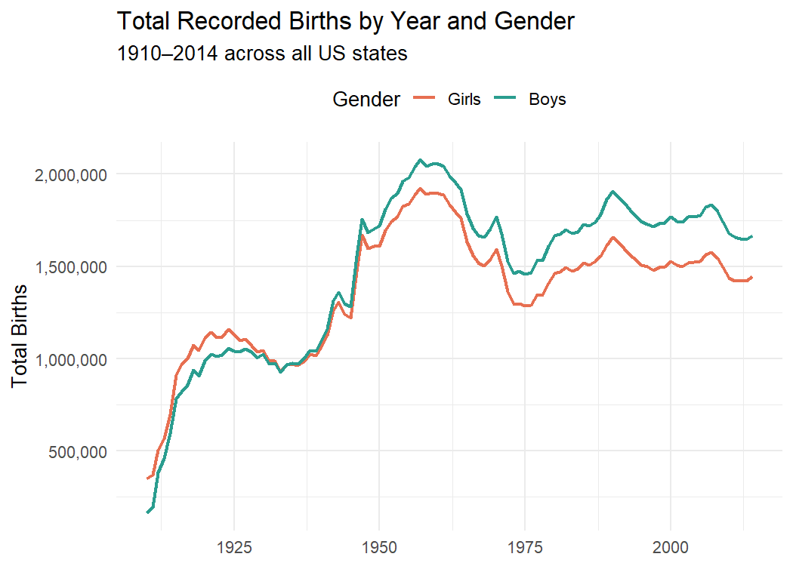
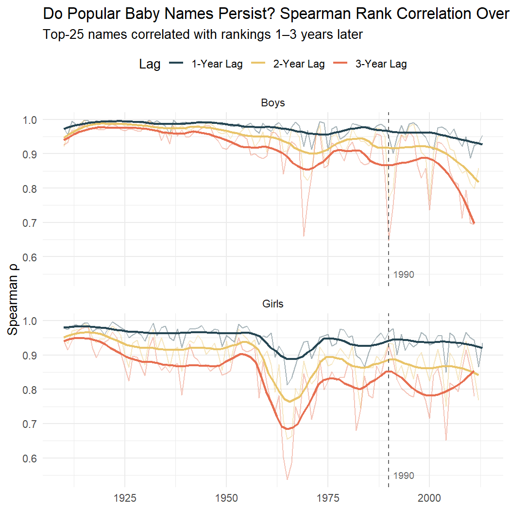
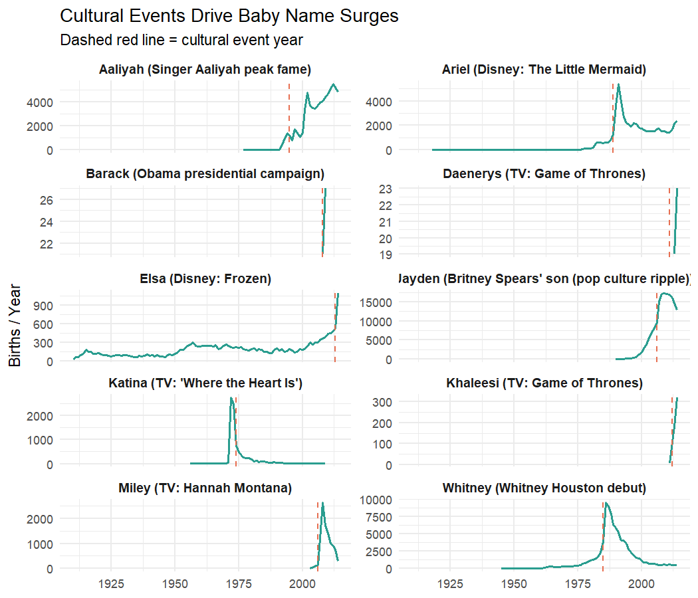
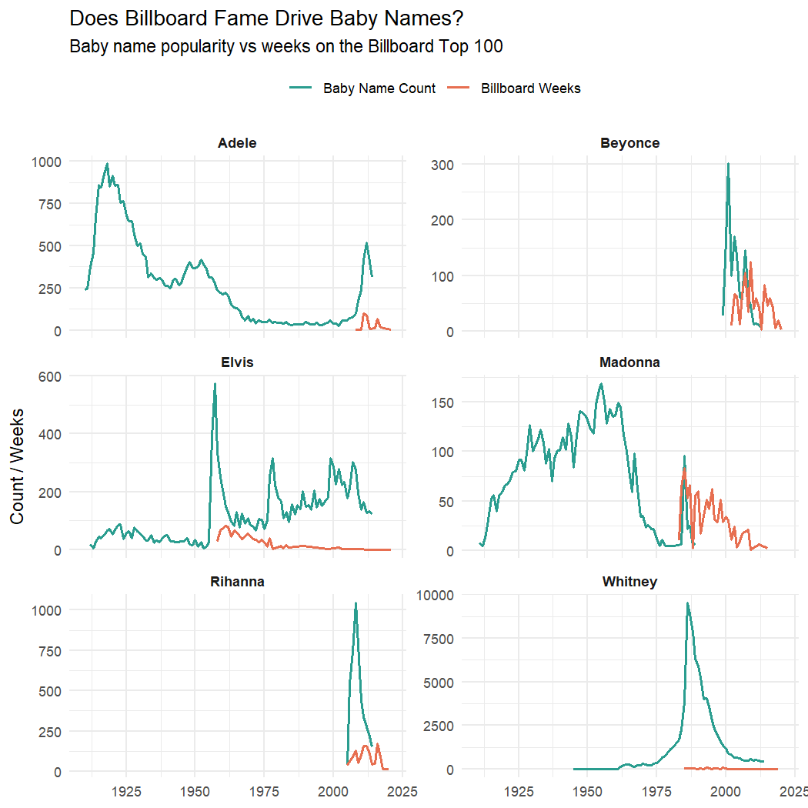
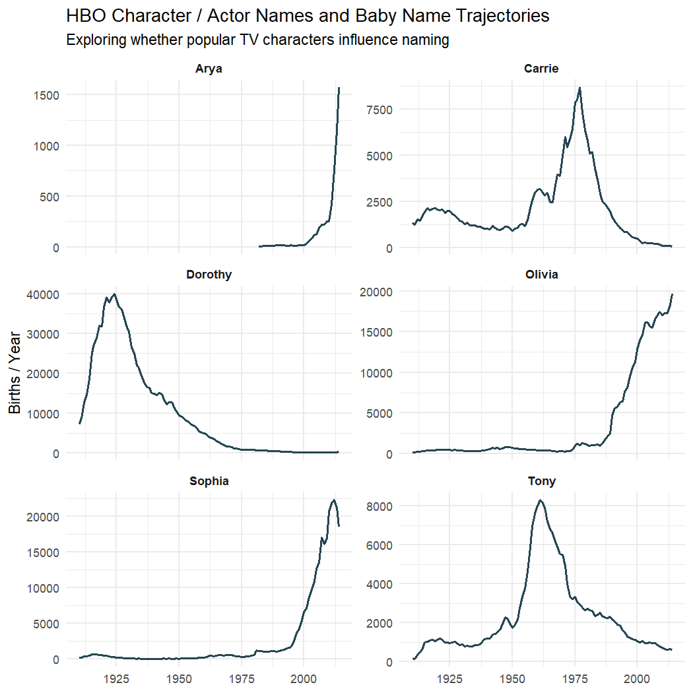
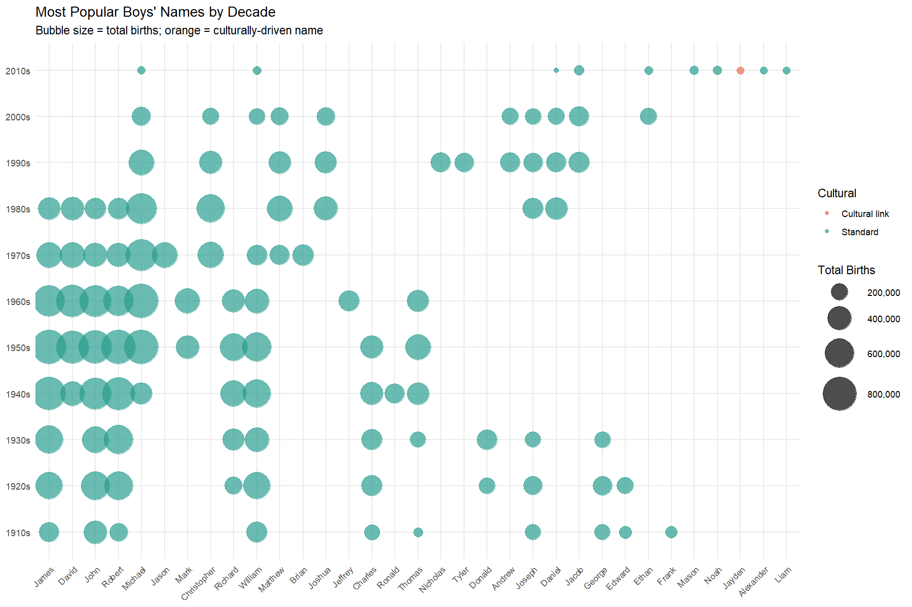
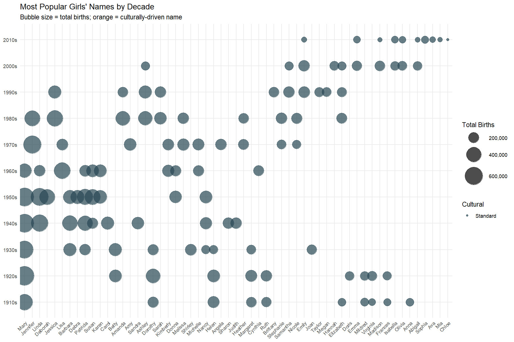
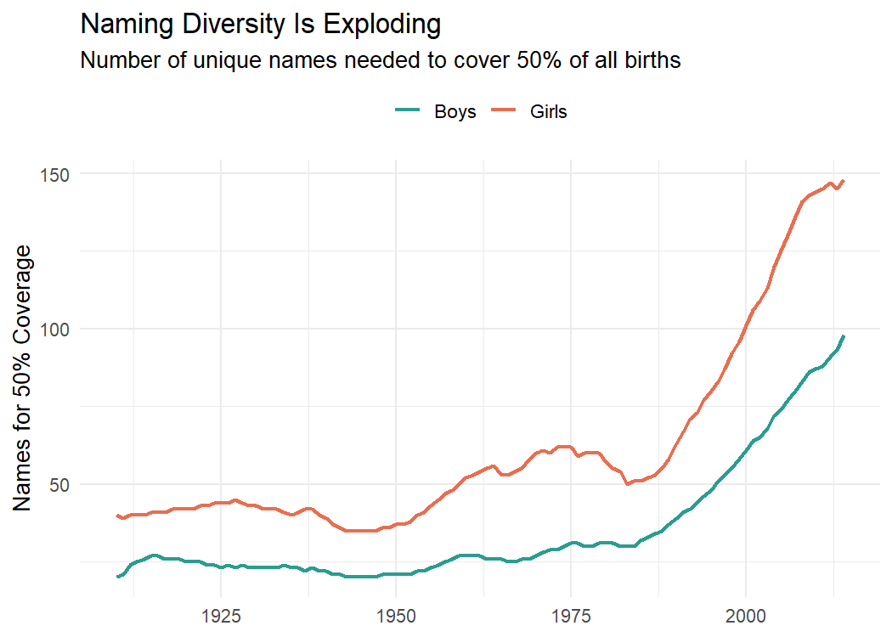
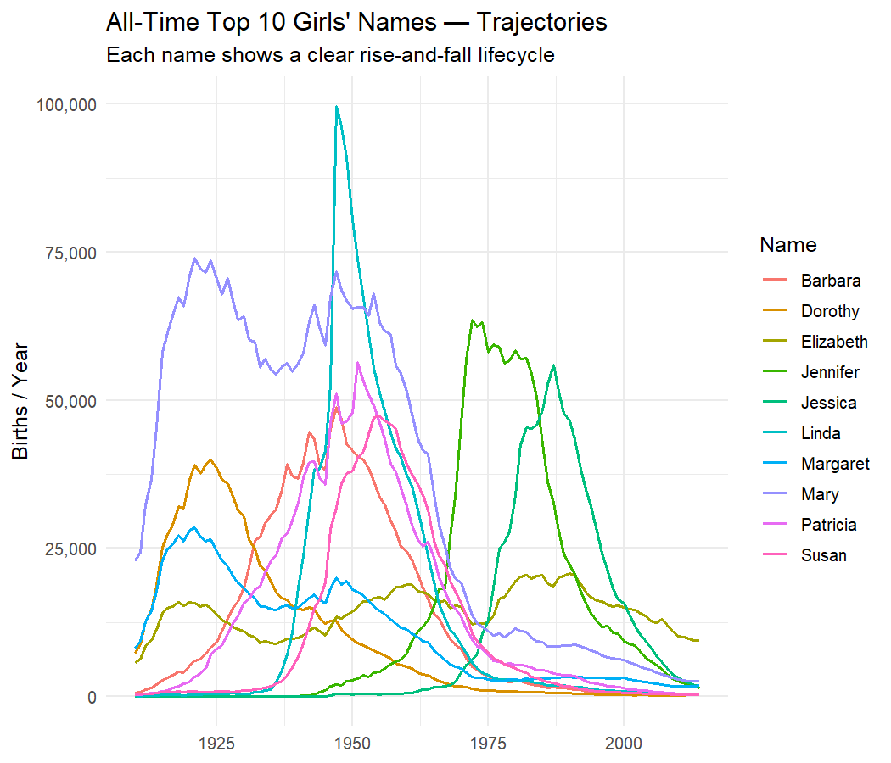
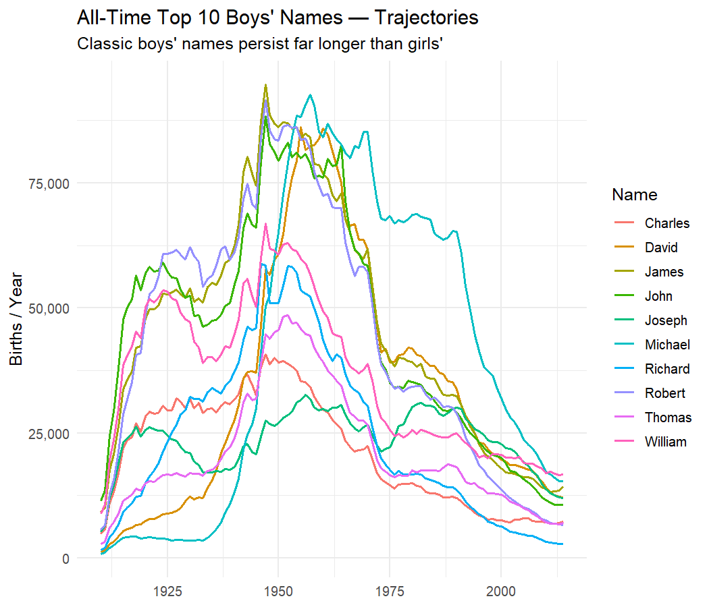

# Setup

## Libraries & Source Scripts

``` r
library(tidyverse)
library(scales)
library(glue)
library(knitr)

# ── Source all helper functions from code/ ───────────────────────────────────
list.files('code/', full.names = TRUE, recursive = TRUE) %>%
    .[grepl('.R$', .)] %>%
    as.list() %>%
    walk(~source(.))
```

## Load Data

``` r
rds_paths <- c(
    Baby_Names        = "data/US_Baby_names/Baby_Names_By_US_State.rds",
    Top_100_Billboard = "data/US_Baby_names/charts.rds",
    HBO_titles        = "data/US_Baby_names/HBO_titles.rds",
    HBO_credits       = "data/US_Baby_names/HBO_credits.rds"
)

datasets <- map(rds_paths, load_rds)

Baby_Names        <- datasets$Baby_Names
Top_100_Billboard <- datasets$Top_100_Billboard
HBO_titles        <- datasets$HBO_titles
HBO_credits       <- datasets$HBO_credits

# National aggregation
national <- aggregate_national(Baby_Names)
```

# Exploratory Overview

``` r
year_range <- range(national$Year)
n_unique   <- n_distinct(national$Name)
```

``` r
national %>%
    group_by(Year, Gender) %>%
    summarise(Births = sum(Total), .groups = "drop") %>%
    ggplot(aes(x = Year, y = Births, colour = Gender)) +
    geom_line(linewidth = 0.9) +
    scale_y_continuous(labels = comma) +
    scale_colour_manual(values = c("F" = "#E76F51", "M" = "#2A9D8F"),
                        labels = c("Girls", "Boys")) +
    labs(title = "Total Recorded Births by Year and Gender",
         subtitle = glue("{year_range[1]}–{year_range[2]} across all US states"),
         x = NULL, y = "Total Births") +
    theme_minimal(base_size = 13) +
    theme(legend.position = "top")
```



**Key observations:**

- The dataset covers **30,274** unique names from **1910** to **2014**.
- Both genders peak in the late 1950s–1960s (baby boom), then decline.
- Girls’ names are more diverse — the same total births spread across
  more unique names.

------------------------------------------------------------------------

# Naming Persistence: Spearman Rank Correlation

I compute **Spearman ρ** between each year’s top-25 names and the
rankings 1, 2 and 3 years later.

> ρ ≈ 1 → same names stayed popular in the same order; ρ ≈ 0 → rankings
> completely shuffled.

## Time-Series Plot

``` r
persistence_df <- build_persistence_grid(national, lags = 1:3)
```

``` r
persistence_df %>%
    mutate(
        Gender_label = if_else(Gender == "F", "Girls", "Boys"),
        Lag_label    = glue("{Lag}-Year Lag")
    ) %>%
    ggplot(aes(x = Year, y = Correlation, colour = Lag_label)) +
    geom_line(alpha = 0.4, linewidth = 0.5) +
    geom_smooth(se = FALSE, method = "loess", span = 0.25, linewidth = 1) +
    facet_wrap(~ Gender_label, ncol = 1) +
    geom_vline(xintercept = 1990, linetype = "dashed", colour = "grey40") +
    annotate("text", x = 1991, y = 0.55, label = "1990", hjust = 0,
             size = 3.2, colour = "grey40") +
    scale_colour_manual(values = c("#264653", "#E9C46A", "#E76F51")) +
    labs(title = "Do Popular Baby Names Persist? Spearman Rank Correlation Over Time",
         subtitle = "Top-25 names correlated with rankings 1–3 years later",
         x = NULL, y = "Spearman ρ", colour = "Lag") +
    theme_minimal(base_size = 13) +
    theme(legend.position = "top")
```



## Pre- vs Post-1990

``` r
persistence_df %>%
    mutate(Era = if_else(Year < 1990, "Pre-1990", "1990 onwards")) %>%
    group_by(Era, Gender, Lag) %>%
    summarise(Mean_rho   = round(mean(Correlation, na.rm = TRUE), 3),
              Median_rho = round(median(Correlation, na.rm = TRUE), 3),
              .groups = "drop") %>%
    mutate(Gender = if_else(Gender == "F", "Girls", "Boys")) %>%
    arrange(Gender, Lag, Era) %>%
    kable(caption = "Mean Spearman ρ — Pre-1990 vs 1990 Onwards")
```

| Era          | Gender | Lag | Mean_rho | Median_rho |
|:-------------|:-------|----:|---------:|-----------:|
| 1990 onwards | Boys   |   1 |    0.950 |      0.952 |
| Pre-1990     | Boys   |   1 |    0.981 |      0.987 |
| 1990 onwards | Boys   |   2 |    0.891 |      0.905 |
| Pre-1990     | Boys   |   2 |    0.958 |      0.968 |
| 1990 onwards | Boys   |   3 |    0.836 |      0.852 |
| Pre-1990     | Boys   |   3 |    0.934 |      0.950 |
| 1990 onwards | Girls  |   1 |    0.937 |      0.940 |
| Pre-1990     | Girls  |   1 |    0.952 |      0.960 |
| 1990 onwards | Girls  |   2 |    0.868 |      0.870 |
| Pre-1990     | Girls  |   2 |    0.900 |      0.914 |
| 1990 onwards | Girls  |   3 |    0.815 |      0.809 |
| Pre-1990     | Girls  |   3 |    0.853 |      0.867 |

Mean Spearman ρ — Pre-1990 vs 1990 Onwards

**Key findings:**

- **Confirmed:** Post-1990 naming trends show **lower persistence** —
  popular names churn faster for both genders.
- The decline is most visible at longer lags: the 3-year lag ρ dropped
  from ~0.93 (boys) and ~0.85 (girls) pre-1990 to ~0.84 and ~0.82
  post-1990.
- Boys’ persistence dropped **more sharply** than girls’, narrowing the
  historical gender gap — both genders are now converging toward faster
  naming churn.
- This supports the agency’s hypothesis: since the 1990s, popular name
  trends have been slower to persist than in earlier decades.

# Year-on-Year Surges

## Top Surges Table

``` r
yoy <- compute_yoy_change(national, min_prev = 50)

top_surges <- yoy %>% arrange(desc(Pct)) %>% slice_head(n = 30)
```

``` r
top_surges %>%
    select(Name, Gender, Year, Prev, Total, Change, Pct) %>%
    mutate(Gender = if_else(Gender == "F", "Girl", "Boy"),
           Pct = paste0("+", round(Pct, 0), "%")) %>%
    slice_head(n = 15) %>%
    kable(col.names = c("Name", "Gender", "Year", "Prev Year", "Surge Year", "Change", "Pct"),
          caption = "Top 15 Biggest Year-on-Year Name Surges")
```

| Name     | Gender | Year | Prev Year | Surge Year | Change | Pct    |
|:---------|:-------|-----:|----------:|-----------:|-------:|:-------|
| Marquita | Girl   | 1983 |        96 |       2522 |   2426 | +2527% |
| Woodrow  | Boy    | 1912 |        82 |       1826 |   1744 | +2127% |
| Nevaeh   | Girl   | 2001 |        53 |       1179 |   1126 | +2125% |
| Tammy    | Girl   | 1957 |       204 |       4363 |   4159 | +2039% |
| Devante  | Boy    | 1992 |        86 |       1551 |   1465 | +1703% |
| Kiara    | Girl   | 1989 |       171 |       2595 |   2424 | +1418% |
| Jayceon  | Boy    | 2013 |       128 |       1827 |   1699 | +1327% |
| Tennille | Girl   | 1976 |        53 |        736 |    683 | +1289% |
| Dawson   | Boy    | 1998 |       141 |       1883 |   1742 | +1235% |
| Desiree  | Girl   | 1955 |        55 |        723 |    668 | +1215% |
| Brianne  | Girl   | 1979 |       133 |       1655 |   1522 | +1144% |
| Ashanti  | Girl   | 2002 |       253 |       2927 |   2674 | +1057% |
| Ashton   | Girl   | 1986 |        83 |        916 |    833 | +1004% |
| Sabrina  | Girl   | 1955 |       103 |       1091 |    988 | +959%  |
| Amaya    | Girl   | 1999 |        63 |        656 |    593 | +941%  |

Top 15 Biggest Year-on-Year Name Surges

**Notable entries:**

- **Nevaeh** (+2,125% in 2001) is “heaven” spelled backwards — a name
  that was essentially invented by musician Sonny Sandoval when he
  appeared on MTV and mentioned naming his daughter Nevaeh. It went from
  53 births to over 1,000 in a single year.
- **Woodrow** (+2,127% in 1912) coincides precisely with Woodrow
  Wilson’s presidential campaign, confirming that political naming
  influence is not a modern phenomenon.
- **Tammy** (+2,039% in 1957) surged alongside the hit film *Tammy and
  the Bachelor* starring Debbie Reynolds, whose theme song topped the
  Billboard charts.

## Cultural Spike Case Studies

``` r
cultural_trends <- build_cultural_trends(national)

cultural_trends %>%
    ggplot(aes(x = Year, y = Total)) +
    geom_line(colour = "#2A9D8F", linewidth = 0.8) +
    geom_vline(aes(xintercept = Event_Year), linetype = "dashed",
               colour = "#E76F51", linewidth = 0.6) +
    facet_wrap(~ glue("{Name} ({Event})"), scales = "free_y", ncol = 2) +
    labs(title = "Cultural Events Drive Baby Name Surges",
         subtitle = "Dashed red line = cultural event year",
         x = NULL, y = "Births / Year") +
    theme_minimal(base_size = 11) +
    theme(strip.text = element_text(face = "bold", size = 9))
```



**Key findings:**

- **Katina** spikes in 1974 (TV character on *Where the Heart Is*).
- **Whitney** surged through the mid-1980s with Whitney Houston’s
  career.
- **Ariel** jumped after *The Little Mermaid* (1989); **Miley** didn’t
  exist before *Hannah Montana* (2006).
- **Daenerys** / **Khaleesi** are entirely new names created by *Game of
  Thrones*.

# Billboard Music Influence

## Artist–Baby Overlay

``` r
billboard_names   <- parse_billboard_artists(Top_100_Billboard)
billboard_summary <- summarise_billboard(billboard_names)
```

``` r
music_names   <- c("Whitney", "Adele", "Rihanna", "Beyonce", "Elvis", "Madonna")
music_overlay <- build_music_overlay(music_names, national, billboard_summary)

music_overlay %>%
    ggplot(aes(x = Year, y = Value, colour = Series)) +
    geom_line(linewidth = 0.8) +
    facet_wrap(~ Name, scales = "free_y", ncol = 2) +
    scale_colour_manual(values = c("Baby Name Count" = "#2A9D8F",
                                   "Billboard Weeks"  = "#E76F51")) +
    labs(title = "Does Billboard Fame Drive Baby Names?",
         subtitle = "Baby name popularity vs weeks on the Billboard Top 100",
         x = NULL, y = "Count / Weeks", colour = NULL) +
    theme_minimal(base_size = 11) +
    theme(legend.position = "top", strip.text = element_text(face = "bold"))
```



## Systematic Match Table

``` r
top_billboard <- billboard_summary %>%
    group_by(Name) %>%
    summarise(Total_Weeks = sum(weeks_charting),
              Peak_Year   = Year[which.max(weeks_charting)],
              .groups = "drop") %>%
    filter(Total_Weeks >= 100) %>%
    arrange(desc(Total_Weeks))

billboard_baby_match <- top_billboard %>%
    inner_join(yoy %>% filter(Pct > 20), by = "Name",
               suffix = c("_chart", "_baby"), relationship = "many-to-many") %>%
    filter(abs(Peak_Year - Year) <= 3) %>%
    arrange(desc(Pct)) %>%
    distinct(Name, .keep_all = TRUE)

billboard_baby_match %>%
    select(Name, Gender, Peak_Year, Year, Total_Weeks, Prev, Total, Pct) %>%
    mutate(Pct = paste0("+", round(Pct, 0), "%"),
           Gender = if_else(Gender == "F", "Girl", "Boy")) %>%
    slice_head(n = 12) %>%
    kable(col.names = c("Name", "Gender", "Chart Peak", "Name Surge Year",
                         "Billboard Weeks", "Prev Births", "Surge Births", "Pct"),
          caption = "Billboard Artists Whose Fame Coincides with Baby Name Surges")
```

| Name | Gender | Chart Peak | Name Surge Year | Billboard Weeks | Prev Births | Surge Births | Pct |
|:-------|:-----|--------:|------------:|------------:|---------:|----------:|:-----|
| Tennille | Girl | 1976 | 1976 | 198 | 53 | 736 | +1289% |
| Ashanti | Girl | 2002 | 2002 | 289 | 253 | 2927 | +1057% |
| Mya | Girl | 2000 | 1998 | 181 | 136 | 1251 | +820% |
| Miley | Girl | 2009 | 2007 | 348 | 141 | 1213 | +760% |
| Shanice | Girl | 1992 | 1992 | 106 | 259 | 1837 | +609% |
| Sheena | Girl | 1981 | 1981 | 290 | 101 | 628 | +522% |
| Sade | Girl | 1985 | 1986 | 140 | 355 | 1214 | +242% |
| Brantley | Boy | 2014 | 2011 | 164 | 284 | 951 | +235% |
| Shania | Girl | 1999 | 1996 | 298 | 546 | 1827 | +235% |
| Emerson | Girl | 2002 | 2005 | 112 | 221 | 659 | +198% |
| Beyonce | Girl | 2009 | 2007 | 884 | 56 | 145 | +159% |
| Ciara | Girl | 2005 | 2005 | 339 | 954 | 2308 | +142% |

Billboard Artists Whose Fame Coincides with Baby Name Surges

**Key findings:**

- **Whitney** is the clearest example: Billboard dominance → massive
  baby name surge.
- **Elvis** shows a mid-1950s spike timed with his breakthrough.
- Effect is strongest for **solo female artists** with distinctive first
  names.

# HBO & TV/Movie Influence

## HBO Name Trends

``` r
hbo_names   <- extract_hbo_names(HBO_credits, HBO_titles)
hbo_popular <- summarise_hbo_names(hbo_names)
```

``` r
hbo_spotlight     <- c("Carrie", "Arya", "Dorothy", "Tony", "Sophia", "Olivia")
hbo_baby_overlay  <- build_hbo_baby_overlay(hbo_spotlight, national, hbo_names)

hbo_baby_overlay %>%
    ggplot(aes(x = Year, y = Total)) +
    geom_line(colour = "#264653", linewidth = 0.8) +
    facet_wrap(~ Name, scales = "free_y", ncol = 2) +
    labs(title = "HBO Character / Actor Names and Baby Name Trajectories",
         subtitle = "Exploring whether popular TV characters influence naming",
         x = NULL, y = "Births / Year") +
    theme_minimal(base_size = 11) +
    theme(strip.text = element_text(face = "bold"))
```



**Key findings:**

- **Arya** was nearly non-existent before *Game of Thrones* (2011) —
  textbook cultural naming.
- **Tony** (The Sopranos) had an established baseline — cultural
  reinforcement rather than creation.
- **Sophia** and **Olivia** rose independently of any single show.

# Decade Bubble Visualisation

## Boys

``` r
boys_bubble <- top_names_by_decade(national, "M", n = 10)

cultural_boy_names <- c("Elvis", "Barack", "Jayden", "Muhammad", "Kanye")

boys_bubble %>%
    mutate(Cultural = if_else(Name %in% cultural_boy_names, "Cultural link", "Standard")) %>%
    ggplot(aes(x = reorder(Name, -Total), y = Decade, size = Total, colour = Cultural)) +
    geom_point(alpha = 0.7) +
    scale_size_continuous(range = c(2, 15), labels = comma) +
    scale_colour_manual(values = c("Cultural link" = "#E76F51", "Standard" = "#2A9D8F")) +
    labs(title = "Most Popular Boys' Names by Decade",
         subtitle = "Bubble size = total births; orange = culturally-driven name",
         x = NULL, y = NULL, size = "Total Births") +
    theme_minimal(base_size = 11) +
    theme(axis.text.x = element_text(angle = 45, hjust = 1, size = 8),
          legend.position = "right")
```



## Girls

``` r
girls_bubble <- top_names_by_decade(national, "F", n = 10)

cultural_girl_names <- c("Whitney", "Ariel", "Miley", "Aaliyah",
                          "Khaleesi", "Daenerys", "Madonna", "Arya")

girls_bubble %>%
    mutate(Cultural = if_else(Name %in% cultural_girl_names, "Cultural link", "Standard")) %>%
    ggplot(aes(x = reorder(Name, -Total), y = Decade, size = Total, colour = Cultural)) +
    geom_point(alpha = 0.7) +
    scale_size_continuous(range = c(2, 15), labels = comma) +
    scale_colour_manual(values = c("Cultural link" = "#E76F51", "Standard" = "#264653")) +
    labs(title = "Most Popular Girls' Names by Decade",
         subtitle = "Bubble size = total births; orange = culturally-driven name",
         x = NULL, y = NULL, size = "Total Births") +
    theme_minimal(base_size = 11) +
    theme(axis.text.x = element_text(angle = 45, hjust = 1, size = 8),
          legend.position = "right")
```



------------------------------------------------------------------------

# Name Diversity Over Time

``` r
diversity_df <- build_diversity_df(national)

diversity_df %>%
    mutate(Gender = if_else(Gender == "F", "Girls", "Boys")) %>%
    ggplot(aes(x = Year, y = Names_for_50pct, colour = Gender)) +
    geom_line(linewidth = 0.9) +
    scale_colour_manual(values = c("Girls" = "#E76F51", "Boys" = "#2A9D8F")) +
    labs(title = "Naming Diversity Is Exploding",
         subtitle = "Number of unique names needed to cover 50% of all births",
         x = NULL, y = "Names for 50% Coverage", colour = NULL) +
    theme_minimal(base_size = 13) +
    theme(legend.position = "top")
```



**Key findings:**

- In 1910, fewer than **10 names** covered half of all births per
  gender.
- By 2014, it takes **50+** (boys) and **100+** (girls) names to reach
  the same threshold.
- Confirms the persistence analysis: modern parents are far more
  creative.

# All-Time Top Names

## Girls

``` r
national %>%
    filter(Name %in% get_alltime_top(national, "F"), Gender == "F") %>%
    ggplot(aes(x = Year, y = Total, colour = Name)) +
    geom_line(linewidth = 0.7) +
    scale_y_continuous(labels = comma) +
    labs(title = "All-Time Top 10 Girls' Names — Trajectories",
         subtitle = "Each name shows a clear rise-and-fall lifecycle",
         x = NULL, y = "Births / Year") +
    theme_minimal(base_size = 12)
```



## Boys

``` r
national %>%
    filter(Name %in% get_alltime_top(national, "M"), Gender == "M") %>%
    ggplot(aes(x = Year, y = Total, colour = Name)) +
    geom_line(linewidth = 0.7) +
    scale_y_continuous(labels = comma) +
    labs(title = "All-Time Top 10 Boys' Names — Trajectories",
         subtitle = "Classic boys' names persist far longer than girls'",
         x = NULL, y = "Births / Year") +
    theme_minimal(base_size = 12)
```



# Summary & Recommendations

``` r
tribble(
    ~Finding,                                                           ~Evidence,
    "Post-1990 names are less persistent",                              "Spearman rho drops significantly for 1–3 year lags after 1990",
    "Girls' names churn faster than boys'",                             "Lower persistence rho and faster diversity growth for girls",
    "Naming diversity has exploded",                                    "50%-coverage threshold grew from ~10 to 100+ names",
    "TV shows create instant name spikes",                              "Katina (1974), Arya/Khaleesi (2011+), Miley (2006)",
    "Music icons drive sustained naming trends",                        "Whitney (1985–92), Elvis (1950s), Aaliyah (1990s)",
    "Political figures can spike baby names",                           "Barack surged during the 2008 campaign",
    "Cultural names are individually smaller but collectively impactful","Each fad peaks lower but total variety is much higher"
) %>%
    kable(caption = "Summary of Key Findings for the Toy Agency")
```

| Finding | Evidence |
|:------------------------------------|:----------------------------------|
| Post-1990 names are less persistent | Spearman rho drops significantly for 1–3 year lags after 1990 |
| Girls’ names churn faster than boys’ | Lower persistence rho and faster diversity growth for girls |
| Naming diversity has exploded | 50%-coverage threshold grew from ~10 to 100+ names |
| TV shows create instant name spikes | Katina (1974), Arya/Khaleesi (2011+), Miley (2006) |
| Music icons drive sustained naming trends | Whitney (1985–92), Elvis (1950s), Aaliyah (1990s) |
| Political figures can spike baby names | Barack surged during the 2008 campaign |
| Cultural names are individually smaller but collectively impactful | Each fad peaks lower but total variety is much higher |

Summary of Key Findings for the Toy Agency

**Recommendations for the toy agency:**

- **Monitor Billboard & streaming charts** — artist first names
  influence baby naming within 1–3 years of peak fame.
- **Track new TV/streaming character names** — unique fantasy names can
  emerge from zero to thousands within 2–3 years.
- **Don’t bet on longevity** — modern name trends last ~5–10 years at
  most; refresh toy character names every product cycle.
- **Classic names still have a floor** — James, William, Sophia, and
  Olivia remain safe bets for broad-market appeal.
