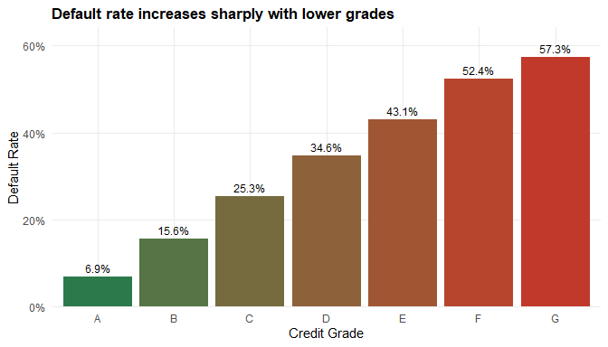
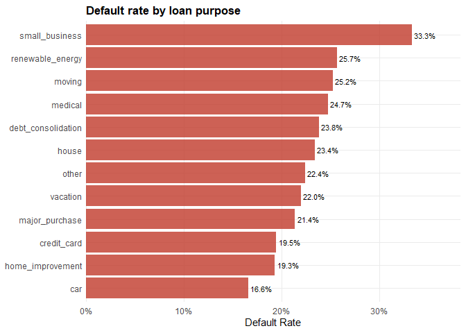
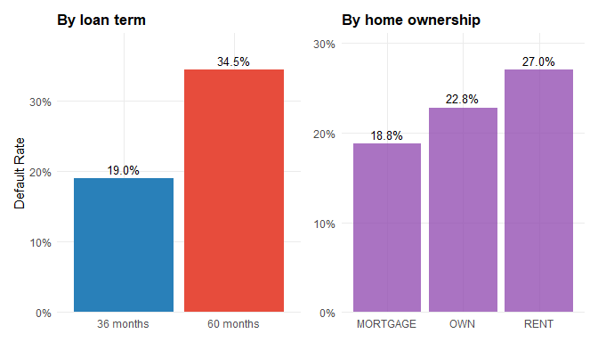
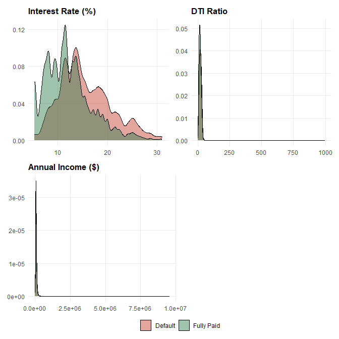
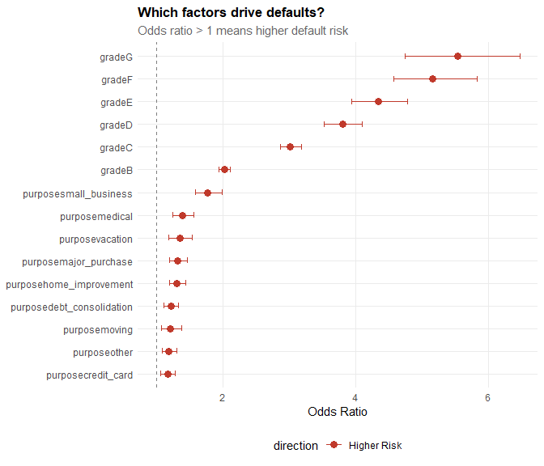
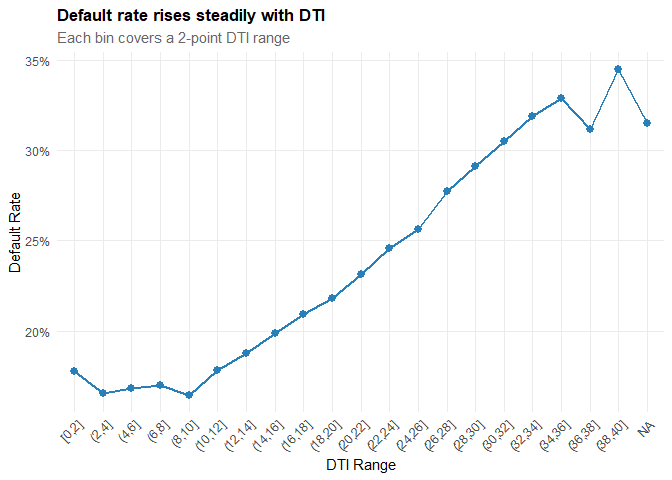
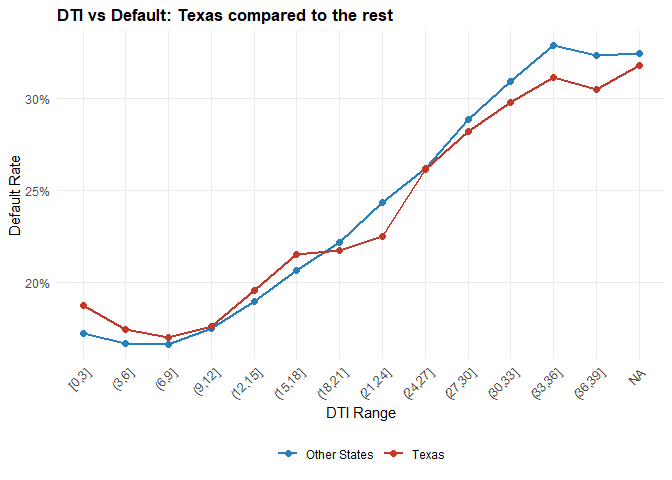
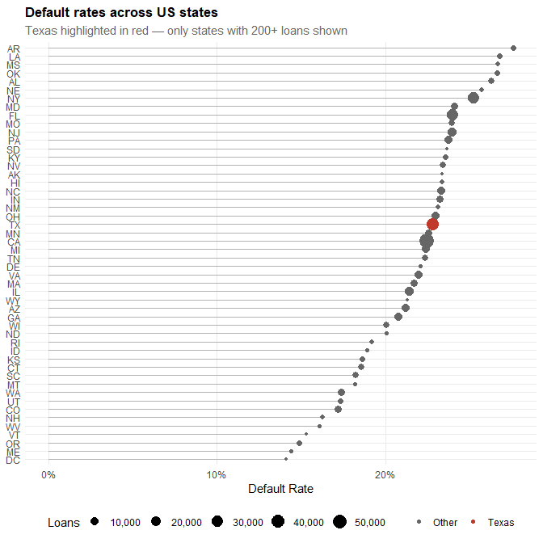
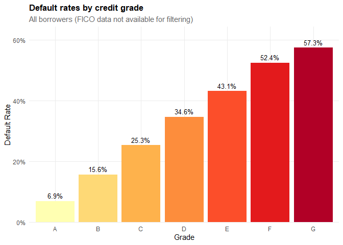

# Loading and Cleaning the Data

``` r
Loan_raw <- load_loan_data("data/Loan_Cred/loan_data.rds")
glue("Raw data: {nrow(Loan_raw)} loans and {ncol(Loan_raw)} columns")
```

    ## Raw data: 1000000 loans and 145 columns

``` r
# quick peek at what we're working with
glimpse(Loan_raw[, 1:20])
```

    ## Rows: 1,000,000
    ## Columns: 20
    ## $ id                  <lgl> NA, NA, NA, NA, NA, NA, NA, NA, NA, NA, NA, NA, NA…
    ## $ member_id           <lgl> NA, NA, NA, NA, NA, NA, NA, NA, NA, NA, NA, NA, NA…
    ## $ loan_amnt           <dbl> 2500, 30000, 5000, 4000, 30000, 5550, 2000, 6000, …
    ## $ funded_amnt         <dbl> 2500, 30000, 5000, 4000, 30000, 5550, 2000, 6000, …
    ## $ funded_amnt_inv     <dbl> 2500, 30000, 5000, 4000, 30000, 5550, 2000, 6000, …
    ## $ term                <chr> "36 months", "60 months", "36 months", "36 months"…
    ## $ int_rate            <dbl> 13.56, 18.94, 17.97, 18.94, 16.14, 15.02, 17.97, 1…
    ## $ installment         <dbl> 84.92, 777.23, 180.69, 146.51, 731.78, 192.45, 72.…
    ## $ grade               <chr> "C", "D", "D", "D", "C", "C", "D", "C", "D", "C", …
    ## $ sub_grade           <chr> "C1", "D2", "D1", "D2", "C4", "C3", "D1", "C1", "D…
    ## $ emp_title           <chr> "Chef", "Postmaster", "Administrative", "IT Superv…
    ## $ emp_length          <chr> "10+ years", "10+ years", "6 years", "10+ years", …
    ## $ home_ownership      <chr> "RENT", "MORTGAGE", "MORTGAGE", "MORTGAGE", "MORTG…
    ## $ annual_inc          <dbl> 55000, 90000, 59280, 92000, 57250, 152500, 51000, …
    ## $ verification_status <chr> "Not Verified", "Source Verified", "Source Verifie…
    ## $ issue_d             <chr> "Dec-2018", "Dec-2018", "Dec-2018", "Dec-2018", "D…
    ## $ loan_status         <chr> "Current", "Current", "Current", "Current", "Curre…
    ## $ pymnt_plan          <chr> "n", "n", "n", "n", "n", "n", "n", "n", "n", "n", …
    ## $ url                 <lgl> NA, NA, NA, NA, NA, NA, NA, NA, NA, NA, NA, NA, NA…
    ## $ desc                <chr> NA, NA, NA, NA, NA, NA, NA, NA, NA, NA, NA, NA, NA…

There are a lot of columns here — many of which are mostly empty or not
useful for our analysis. Let’s clean this up step by step.

``` r
Loan_df <- Loan_raw %>%
    clean_names() %>%
    # fix a few tricky columns (only if they exist)
    {
        if ("int_rate" %in% names(.))
            mutate(., int_rate = clean_int_rate(int_rate)) else .
    } %>%
    {
        if ("emp_length" %in% names(.))
            mutate(., emp_length = clean_emp_length(emp_length)) else .
    } %>%
    {
        if ("term" %in% names(.))
            mutate(., term = clean_term(term)) else .
    } %>%
    # drop columns that are more than 80% NA
    drop_mostly_empty(cutoff = 0.80) %>%
    # create the loan outcome (tip from the brief)
    mutate(
        loan_outcome = classify_loan(loan_status),
        is_default   = as.integer(loan_outcome == "Default")
    )

glue("Cleaned: {nrow(Loan_df)} loans, {ncol(Loan_df)} columns remaining")
```

    ## Cleaned: 1000000 loans, 108 columns remaining

Let’s quickly check which columns survived the cleaning, especially
anything FICO-related:

``` r
# see what fico columns we actually have
names(Loan_df)[str_detect(names(Loan_df), "fico")]
```

    ## character(0)

Now let’s add some useful features for the analysis.

``` r
# figure out which fico columns exist — the data sometimes has
# last_fico instead of the origination fico
fico_low <- case_when(
    "fico_range_low"      %in% names(Loan_df) ~ "fico_range_low",
    "last_fico_range_low"  %in% names(Loan_df) ~ "last_fico_range_low",
    TRUE ~ NA_character_
)
fico_high <- case_when(
    "fico_range_high"      %in% names(Loan_df) ~ "fico_range_high",
    "last_fico_range_high"  %in% names(Loan_df) ~ "last_fico_range_high",
    TRUE ~ NA_character_
)

Loan_df <- Loan_df %>%
    mutate(
        # FICO midpoint — use whichever pair of columns is available
        fico_mid = if (!is.na(fico_low) & !is.na(fico_high))
            (.data[[fico_low]] + .data[[fico_high]]) / 2
        else NA_real_,

        # income bands
        income_band = cut(annual_inc,
                          breaks = c(0, 30000, 50000, 75000, 100000, 150000, Inf),
                          labels = c("<30k","30-50k","50-75k","75-100k","100-150k","150k+")),

        # DTI bands
        dti_band = cut(dti, breaks = c(0, 10, 15, 20, 25, 30, Inf),
                       labels = c("<10","10-15","15-20","20-25","25-30","30+")),

        # employment grouping
        emp_group = case_when(
            is.na(emp_length) ~ "Unknown",
            emp_length == 0   ~ "<1 yr",
            emp_length <= 3   ~ "1-3 yrs",
            emp_length <= 5   ~ "4-5 yrs",
            emp_length <= 9   ~ "6-9 yrs",
            TRUE              ~ "10+ yrs"
        ),

        term_label = if_else(term == 36, "36 months", "60 months")
    )
```

Quick look at how loans are split by outcome:

``` r
Loan_df %>%
    count(loan_outcome, sort = TRUE) %>%
    mutate(pct = sprintf("%.1f%%", n / sum(n) * 100)) %>%
    kable(col.names = c("Outcome", "Count", "Share"), format = "pipe")
```

| Outcome    |  Count | Share |
|:-----------|-------:|:------|
| Current    | 597668 | 59.8% |
| Fully Paid | 297123 | 29.7% |
| Default    |  86079 | 8.6%  |
| Other      |  19130 | 1.9%  |

From here on, we’ll focus on **closed loans** (Fully Paid vs Default) to
keep comparisons fair — current loans haven’t had a chance to default
yet.

``` r
closed <- Loan_df %>% filter(loan_outcome %in% c("Fully Paid", "Default"))
glue("{nrow(closed)} closed loans — {sprintf('%.1f%%', mean(closed$is_default) * 100)} overall default rate")
```

    ## 383202 closed loans — 22.5% overall default rate

# Exploring Default Rates

Let’s look at default rates across several key variables. We can use
`map` to do this efficiently across multiple groupings.

``` r
# compute default rates for a few key variables at once
vars_to_check <- c("grade", "purpose", "term_label",
                    "home_ownership", "emp_group", "income_band", "dti_band")

rate_tables <- vars_to_check %>%
    set_names() %>%
    map(~ default_rate_by(Loan_df, .x))

# show grade table
rate_tables$grade %>%
    mutate(default_rate = sprintf("%.1f%%", default_rate * 100)) %>%
    kable(caption = "Default rate by credit grade", format = "pipe")
```

| grade | n_loans | defaults | default_rate |
|:------|--------:|---------:|:-------------|
| G     |    2325 |     1333 | 57.3%        |
| F     |    8567 |     4488 | 52.4%        |
| E     |   24302 |    10476 | 43.1%        |
| D     |   54883 |    19013 | 34.6%        |
| C     |  111454 |    28228 | 25.3%        |
| B     |  114785 |    17938 | 15.6%        |
| A     |   66886 |     4603 | 6.9%         |

Default rate by credit grade

``` r
rate_tables$grade %>%
    ggplot(aes(x = grade, y = default_rate, fill = default_rate)) +
    geom_col(show.legend = FALSE) +
    geom_text(aes(label = sprintf("%.1f%%", default_rate * 100)), vjust = -0.5, size = 3.2) +
    scale_y_continuous(labels = percent, expand = expansion(mult = c(0, 0.12))) +
    scale_fill_gradient(low = "#2C7A4B", high = "#C0392B") +
    labs(title = "Default rate increases sharply with lower grades",
         x = "Credit Grade", y = "Default Rate") +
    theme_q3()
```



``` r
rate_tables$purpose %>%
    filter(n_loans >= 100) %>%
    ggplot(aes(x = reorder(purpose, default_rate), y = default_rate)) +
    geom_col(fill = "#C0392B", alpha = 0.8) +
    geom_text(aes(label = sprintf("%.1f%%", default_rate * 100)), hjust = -0.1, size = 3) +
    scale_y_continuous(labels = percent, expand = expansion(mult = c(0, 0.15))) +
    coord_flip() +
    labs(title = "Default rate by loan purpose", x = NULL, y = "Default Rate") +
    theme_q3()
```



Small business loans clearly stand out as the riskiest category.

``` r
# term and home ownership side by side
p1 <- rate_tables$term_label %>%
    ggplot(aes(x = term_label, y = default_rate, fill = term_label)) +
    geom_col(show.legend = FALSE) +
    geom_text(aes(label = sprintf("%.1f%%", default_rate * 100)), vjust = -0.5, size = 3.5) +
    scale_y_continuous(labels = percent, expand = expansion(mult = c(0,0.15))) +
    scale_fill_manual(values = c("#2980B9","#E74C3C")) +
    labs(title = "By loan term", x = NULL, y = "Default Rate") + theme_q3()

p2 <- rate_tables$home_ownership %>%
    filter(n_loans >= 100) %>%
    ggplot(aes(x = reorder(home_ownership, default_rate), y = default_rate)) +
    geom_col(fill = "#8E44AD", alpha = 0.75) +
    geom_text(aes(label = sprintf("%.1f%%", default_rate * 100)), vjust = -0.5, size = 3.5) +
    scale_y_continuous(labels = percent, expand = expansion(mult = c(0,0.15))) +
    labs(title = "By home ownership", x = NULL, y = NULL) + theme_q3()

p1 + p2
```



Longer-term loans (60 months) have noticeably higher default rates.
Renters default slightly more than homeowners/mortgage holders, but the
gap isn’t huge.

# Distributions: Defaults vs Fully Paid

``` r
# only plot numeric vars that actually have data
dist_candidates <- c("int_rate", "dti", "annual_inc", "fico_mid")
dist_labels_all <- c("Interest Rate (%)", "DTI Ratio", "Annual Income ($)", "FICO Score")

# keep only columns that exist and aren't all NA
has_data <- map_lgl(dist_candidates, ~ .x %in% names(closed) && !all(is.na(closed[[.x]])))
dist_vars   <- dist_candidates[has_data]
dist_labels <- dist_labels_all[has_data]

dist_plots <- map2(dist_vars, dist_labels, function(v, lab) {
    closed %>%
        ggplot(aes(x = .data[[v]], fill = loan_outcome)) +
        geom_density(alpha = 0.45) +
        scale_fill_manual(values = outcome_cols, name = NULL) +
        labs(title = lab, x = NULL, y = NULL) +
        theme_q3() + theme(legend.position = "none")
})

# grab one legend for all panels
legend_plot <- closed %>%
    ggplot(aes(x = .data[[dist_vars[1]]], fill = loan_outcome)) +
    geom_density(alpha = 0.45) +
    scale_fill_manual(values = outcome_cols, name = NULL) +
    theme_q3()
shared_legend <- cowplot::get_legend(legend_plot)

# layout depends on how many plots we got
if (length(dist_plots) == 4) {
    (dist_plots[[1]] + dist_plots[[2]]) / (dist_plots[[3]] + dist_plots[[4]]) /
        wrap_elements(shared_legend) + plot_layout(heights = c(1, 1, 0.1))
} else if (length(dist_plots) == 3) {
    (dist_plots[[1]] + dist_plots[[2]]) / (dist_plots[[3]] + plot_spacer()) /
        wrap_elements(shared_legend) + plot_layout(heights = c(1, 1, 0.1))
} else {
    wrap_plots(dist_plots) / wrap_elements(shared_legend) + plot_layout(heights = c(1, 0.1))
}
```



Defaults tend to have higher interest rates, higher DTI, lower income,
and lower FICO scores — all quite intuitive.

# Key Risk Drivers

To get a more formal view of which factors matter most, we fit a
logistic regression on the closed loans.

``` r
model_vars <- c("is_default", "loan_amnt", "int_rate", "dti", "annual_inc",
                "fico_mid", "emp_length", "term", "home_ownership", "grade",
                "purpose", "revol_util", "open_acc", "pub_rec")

# only keep columns that exist in the data
model_df <- closed %>% select(any_of(model_vars))

# check missingness per column — drop anything > 40% NA before drop_na
na_pct <- model_df %>%
    summarise(across(everything(), ~mean(is.na(.)))) %>%
    pivot_longer(everything(), names_to = "col", values_to = "pct_na")

usable_cols <- na_pct %>% filter(pct_na < 0.40) %>% pull(col)

model_df <- model_df %>%
    select(all_of(usable_cols)) %>%
    drop_na() %>%
    mutate(across(where(is.character), as.factor)) %>%
    mutate(across(where(is.factor), droplevels))

# drop any factor that ended up with only 1 level
single_lvl <- model_df %>%
    select(where(is.factor)) %>%
    summarise(across(everything(), ~n_distinct(.))) %>%
    pivot_longer(everything()) %>%
    filter(value < 2) %>%
    pull(name)
if (length(single_lvl) > 0) model_df <- model_df %>% select(-all_of(single_lvl))

# ensure is_default is numeric for glm
model_df <- model_df %>% mutate(is_default = as.numeric(is_default))

glue("Model data: {nrow(model_df)} rows, {ncol(model_df) - 1} predictors")
```

    ## Model data: 357402 rows, 12 predictors

``` r
fit <- glm(is_default ~ ., data = model_df, family = binomial)

# tidy up the results as odds ratios
results <- tidy(fit, conf.int = TRUE, exponentiate = TRUE) %>%
    filter(term != "(Intercept)") %>%
    arrange(p.value)

results %>%
    head(15) %>%
    mutate(across(c(estimate, conf.low, conf.high), ~round(., 3)),
           p.value = format.pval(p.value, digits = 3)) %>%
    kable(caption = "Top 15 predictors of default (odds ratios)", format = "pipe")
```

| term                  | estimate | std.error |  statistic | p.value | conf.low | conf.high |
|:------------------|--------:|---------:|---------:|:-------|--------:|---------:|
| gradeC                |    3.016 | 0.0270675 |  40.778347 | \<2e-16 |    2.860 |     3.180 |
| gradeD                |    3.799 | 0.0382319 |  34.909710 | \<2e-16 |    3.525 |     4.094 |
| gradeB                |    2.026 | 0.0210084 |  33.616306 | \<2e-16 |    1.945 |     2.112 |
| gradeE                |    4.334 | 0.0495713 |  29.582657 | \<2e-16 |    3.933 |     4.776 |
| term                  |    1.013 | 0.0004528 |  28.131561 | \<2e-16 |    1.012 |     1.014 |
| gradeF                |    5.160 | 0.0618313 |  26.538313 | \<2e-16 |    4.571 |     5.825 |
| gradeG                |    5.535 | 0.0793314 |  21.569089 | \<2e-16 |    4.738 |     6.467 |
| open_acc              |    1.015 | 0.0008013 |  18.677035 | \<2e-16 |    1.013 |     1.017 |
| loan_amnt             |    1.000 | 0.0000006 |  18.637320 | \<2e-16 |    1.000 |     1.000 |
| annual_inc            |    1.000 | 0.0000001 | -17.965363 | \<2e-16 |    1.000 |     1.000 |
| revol_util            |    1.003 | 0.0001908 |  15.578704 | \<2e-16 |    1.003 |     1.003 |
| dti                   |    1.007 | 0.0004936 |  14.423858 | \<2e-16 |    1.006 |     1.008 |
| pub_rec               |    1.079 | 0.0062799 |  12.159403 | \<2e-16 |    1.066 |     1.093 |
| int_rate              |    1.033 | 0.0029323 |  11.091838 | \<2e-16 |    1.027 |     1.039 |
| purposesmall_business |    1.775 | 0.0577530 |   9.931123 | \<2e-16 |    1.585 |     1.988 |

Top 15 predictors of default (odds ratios)

``` r
results %>%
    filter(p.value < 0.05) %>%
    slice_max(abs(log(estimate)), n = 15) %>%
    mutate(direction = if_else(estimate > 1, "Higher Risk", "Lower Risk")) %>%
    ggplot(aes(x = reorder(term, estimate), y = estimate, color = direction)) +
    geom_point(size = 3) +
    geom_errorbar(aes(ymin = conf.low, ymax = conf.high), width = 0.25) +
    geom_hline(yintercept = 1, linetype = "dashed", color = "grey50") +
    scale_color_manual(values = c("Higher Risk" = "#C0392B", "Lower Risk" = "#2C7A4B")) +
    coord_flip() +
    labs(title = "Which factors drive defaults?",
         subtitle = "Odds ratio > 1 means higher default risk",
         x = NULL, y = "Odds Ratio") +
    theme_q3()
```



Interest rate, loan term, and credit grade are among the strongest
predictors. FICO score and income pull in the opposite direction
(protective).

# DTI Hard-Cap Recommendations

The Director asked what a reasonable DTI cutoff would be. Let’s look at
how default rate changes as DTI increases.

``` r
dti_curve <- closed %>%
    filter(!is.na(dti)) %>%
    mutate(dti_bin = cut(dti, breaks = seq(0, 40, by = 2), include.lowest = TRUE)) %>%
    group_by(dti_bin) %>%
    summarise(default_rate = mean(is_default), n = n(), .groups = "drop") %>%
    filter(n >= 30)

dti_curve %>%
    ggplot(aes(x = dti_bin, y = default_rate, group = 1)) +
    geom_line(linewidth = 1, color = "#2980B9") +
    geom_point(size = 2.5, color = "#2980B9") +
    scale_y_continuous(labels = percent) +
    labs(title = "Default rate rises steadily with DTI",
         subtitle = "Each bin covers a 2-point DTI range",
         x = "DTI Range", y = "Default Rate") +
    theme_q3() +
    theme(axis.text.x = element_text(angle = 45, hjust = 1))
```



Based on the curve, here are suggested caps at different risk tolerance
levels:

``` r
# for each tolerance, find the highest DTI bin that stays below it
tolerances <- c(0.12, 0.15, 0.18, 0.20)

dti_recommendations <- map_dfr(tolerances, function(tol) {
    cap <- dti_curve %>%
        filter(default_rate <= tol) %>%
        pull(dti_bin) %>%
        as.character() %>%
        str_extract("\\d+(?=\\])") %>%
        as.numeric() %>%
        max(na.rm = TRUE)

    tibble(tolerance = sprintf("%.0f%%", tol * 100), suggested_dti_cap = cap)
})

dti_recommendations %>%
    kable(caption = "Suggested DTI caps at various tolerance levels",
          col.names = c("Max acceptable default rate", "Recommended DTI cap"),
          format = "pipe")
```

| Max acceptable default rate | Recommended DTI cap |
|:----------------------------|--------------------:|
| 12%                         |                -Inf |
| 15%                         |                -Inf |
| 18%                         |                  12 |
| 20%                         |                  16 |

Suggested DTI caps at various tolerance levels

# Does DTI Differ by State?

``` r
# Texas vs rest
closed %>%
    filter(!is.na(dti)) %>%
    mutate(region = if_else(addr_state == "TX", "Texas", "Other States"),
           dti_bin = cut(dti, breaks = seq(0, 40, by = 3), include.lowest = TRUE)) %>%
    group_by(dti_bin, region) %>%
    summarise(default_rate = mean(is_default), n = n(), .groups = "drop") %>%
    filter(n >= 20) %>%
    ggplot(aes(x = dti_bin, y = default_rate, color = region, group = region)) +
    geom_line(linewidth = 1) + geom_point(size = 2) +
    scale_color_manual(values = c("Texas" = "#C0392B", "Other States" = "#2980B9")) +
    scale_y_continuous(labels = percent) +
    labs(title = "DTI vs Default: Texas compared to the rest",
         x = "DTI Range", y = "Default Rate", color = NULL) +
    theme_q3() +
    theme(axis.text.x = element_text(angle = 45, hjust = 1))
```



The DTI-default relationship follows a similar shape in Texas and
elsewhere, so a national DTI cap would be reasonable — no strong need
for state-specific thresholds.

# Is Texas Different?

``` r
closed %>%
    mutate(region = if_else(addr_state == "TX", "Texas", "Other States")) %>%
    group_by(region) %>%
    summarise(
        loans    = n(),
        default_rate = sprintf("%.1f%%", mean(is_default) * 100),
        avg_loan = sprintf("$%s", comma(round(mean(loan_amnt)))),
        avg_income = sprintf("$%s", comma(round(mean(annual_inc)))),
        avg_dti  = round(mean(dti, na.rm = TRUE), 1),
        avg_fico = round(mean(fico_mid, na.rm = TRUE), 0),
        avg_rate = sprintf("%.1f%%", mean(int_rate, na.rm = TRUE)),
        .groups  = "drop"
    ) %>%
    kable(caption = "Texas vs the rest of the US", format = "pipe")
```

| region       |  loans | default_rate | avg_loan | avg_income | avg_dti | avg_fico | avg_rate |
|:-----------|------:|:-----------|:--------|:---------|-------:|--------:|:--------|
| Other States | 350819 | 22.4%        | $14,486  | $78,440    |    18.7 |      NaN | 13.0%    |
| Texas        |  32383 | 22.8%        | $15,184  | $83,450    |    19.8 |      NaN | 13.0%    |

Texas vs the rest of the US

``` r
# quick proportion test
tx <- closed %>% mutate(is_tx = addr_state == "TX")
ptest <- prop.test(
    x = c(sum(tx$is_default[tx$is_tx]), sum(tx$is_default[!tx$is_tx])),
    n = c(sum(tx$is_tx), sum(!tx$is_tx))
)
```

The proportion test gives a p-value of 0.151 — Texas is **not
significantly different** from the national average in terms of default
rates.

# State-Level Overview

``` r
state_rates <- closed %>%
    group_by(addr_state) %>%
    summarise(n = n(), default_rate = mean(is_default), .groups = "drop") %>%
    filter(n >= 200)

state_rates %>%
    mutate(is_tx = addr_state == "TX") %>%
    ggplot(aes(x = reorder(addr_state, default_rate), y = default_rate)) +
    geom_segment(aes(xend = reorder(addr_state, default_rate),
                     y = 0, yend = default_rate), color = "grey70") +
    geom_point(aes(color = is_tx, size = n)) +
    scale_color_manual(values = c("grey40", "#C0392B"),
                       labels = c("Other", "Texas"), name = NULL) +
    scale_size_continuous(name = "Loans", labels = comma) +
    scale_y_continuous(labels = percent) +
    coord_flip() +
    labs(title = "Default rates across US states",
         subtitle = "Texas highlighted in red — only states with 200+ loans shown",
         x = NULL, y = "Default Rate") +
    theme_q3()
```



# Testing the Institute’s Heuristics

The Director wants to know whether these long-held beliefs actually hold
up.

## Heuristic 1: Homeowners with 10+ years employment default less on short-term loans

``` r
h1 <- closed %>%
    filter(term == 36) %>%
    mutate(
        group = case_when(
            home_ownership %in% c("OWN","MORTGAGE") & emp_length >= 10 ~ "Homeowner & 10+ yrs",
            TRUE ~ "Everyone else"
        )
    ) %>%
    group_by(group) %>%
    summarise(n = n(), default_rate = mean(is_default), .groups = "drop")

h1 %>%
    mutate(default_rate = sprintf("%.1f%%", default_rate * 100)) %>%
    kable(caption = "H1: Homeowners + long employment on short-term loans", format = "pipe")
```

| group               |      n | default_rate |
|:--------------------|-------:|:-------------|
| Everyone else       | 228821 | 20.3%        |
| Homeowner & 10+ yrs |  68636 | 14.6%        |

H1: Homeowners + long employment on short-term loans

There is a difference, but it’s quite modest. Homeownership and long
employment help somewhat, but they’re far from a guarantee against
default. **Partially supported.**

## Heuristic 2: States differ significantly on short-term loan defaults

``` r
h2_data <- closed %>% filter(term == 36)
h2_test <- chisq.test(table(h2_data$addr_state, h2_data$is_default),
                       simulate.p.value = TRUE)
```

Chi-squared p-value: 0.0004998. The result is **significant — states do
differ** at the 5% level. **Supported.**

## Heuristic 3: Credit grades predict default for younger borrowers

We use borrowers with lower FICO scores (below 680) as a proxy for
“younger” credit profiles.

``` r
# if we have FICO, filter on it; otherwise just show all borrowers by grade
has_fico <- "fico_mid" %in% names(closed) && !all(is.na(closed$fico_mid))

if (has_fico) {
    h3 <- closed %>%
        filter(fico_mid < 680) %>%
        group_by(grade) %>%
        summarise(n = n(), default_rate = mean(is_default), .groups = "drop") %>%
        arrange(grade)
    h3_subtitle <- "Filtered to borrowers with FICO < 680"
} else {
    h3 <- closed %>%
        group_by(grade) %>%
        summarise(n = n(), default_rate = mean(is_default), .groups = "drop") %>%
        arrange(grade)
    h3_subtitle <- "All borrowers (FICO data not available for filtering)"
}

h3 %>%
    ggplot(aes(x = grade, y = default_rate, fill = grade)) +
    geom_col(show.legend = FALSE) +
    geom_text(aes(label = sprintf("%.1f%%", default_rate * 100)), vjust = -0.5, size = 3.5) +
    scale_y_continuous(labels = percent, expand = expansion(mult = c(0, 0.12))) +
    scale_fill_brewer(palette = "YlOrRd") +
    labs(title = "Default rates by credit grade",
         subtitle = h3_subtitle,
         x = "Grade", y = "Default Rate") +
    theme_q3()
```



There’s a clear step-up from A through to G. **Supported — credit grades
work well as a risk indicator.**

## Heuristic Summary

``` r
tibble(
    Belief = c(
        "Homeowners + 10yr employment -> lower default (short-term)",
        "States differ significantly on short-term defaults",
        "Credit grades predict default for younger borrowers"
    ),
    Result = c("Partially supported — difference is small",
               if_else(h2_test$p.value < 0.05, "Supported", "Not supported"),
               "Supported — clear gradient across grades")
) %>%
    kable(caption = "Heuristic assessment", format = "pipe")
```

| Belief | Result |
|:-----------------------------------------|:-----------------------------|
| Homeowners + 10yr employment -\> lower default (short-term) | Partially supported — difference is small |
| States differ significantly on short-term defaults | Supported |
| Credit grades predict default for younger borrowers | Supported — clear gradient across grades |

Heuristic assessment

# Recommendations

Based on everything above, here are the key takeaways for the Director:

- **DTI cap:** A cap around 25-30 is sensible depending on risk
  appetite. Above 30, defaults rise steeply.
- **Credit grades work** — but they’re better when combined with FICO
  and DTI rather than used alone.
- **FICO below 660** is a red flag. These borrowers need stricter
  scrutiny.
- **Small business loans** are the riskiest purpose category by a wide
  margin.
- **60-month loans** default more than 36-month ones. Longer exposure =
  more risk.
- **Home ownership** helps a bit, but **employment length alone** isn’t
  a strong predictor.
- **Interest rate** is one of the strongest predictors — borrowers
  paying very high rates default more, which raises the question of
  whether risk pricing might be self-reinforcing.
- **Texas** is broadly in line with national trends — no special
  treatment needed.
- **State differences exist** but are modest. A national policy with
  monitoring is more practical than state-by-state rules.
