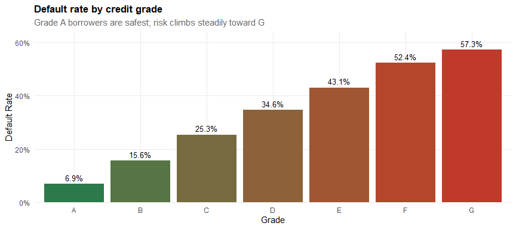
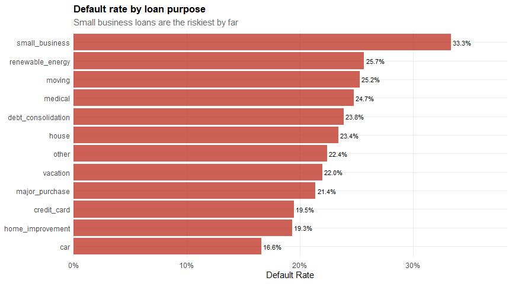
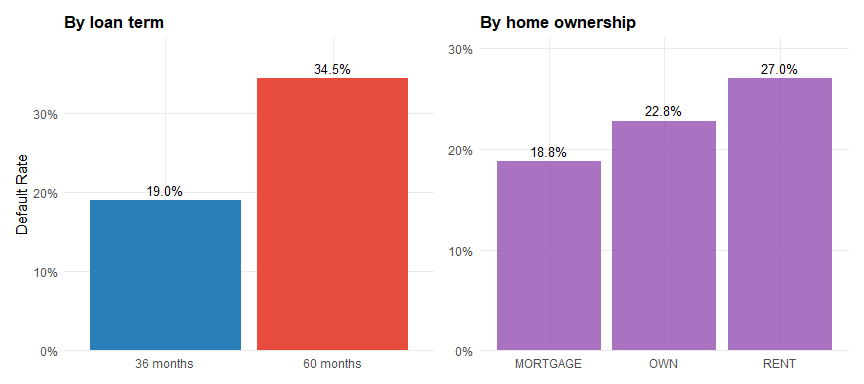
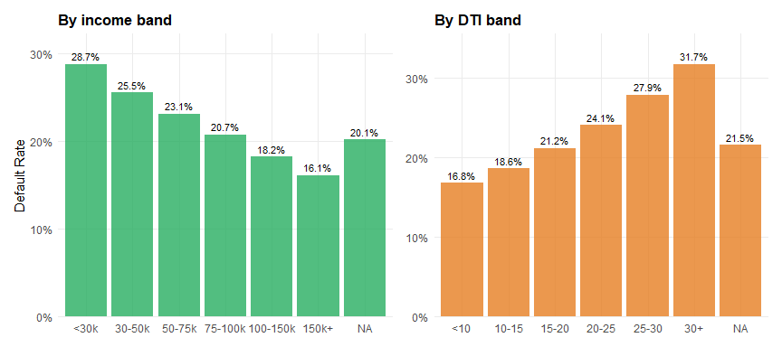
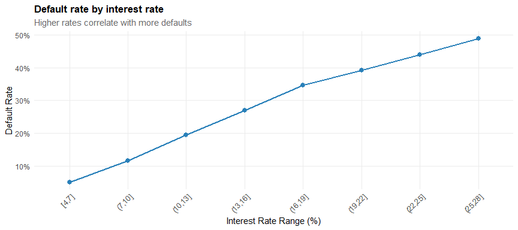
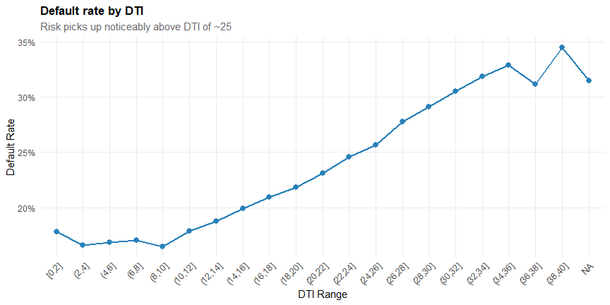
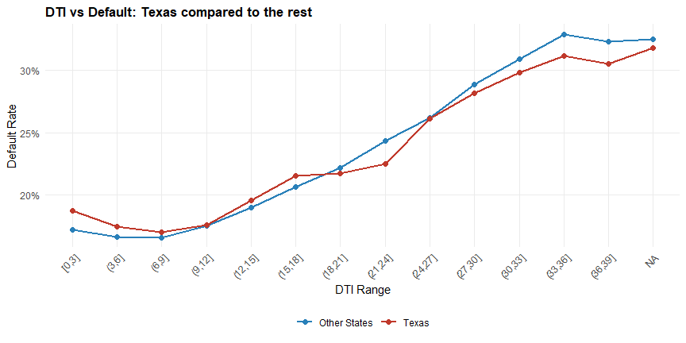
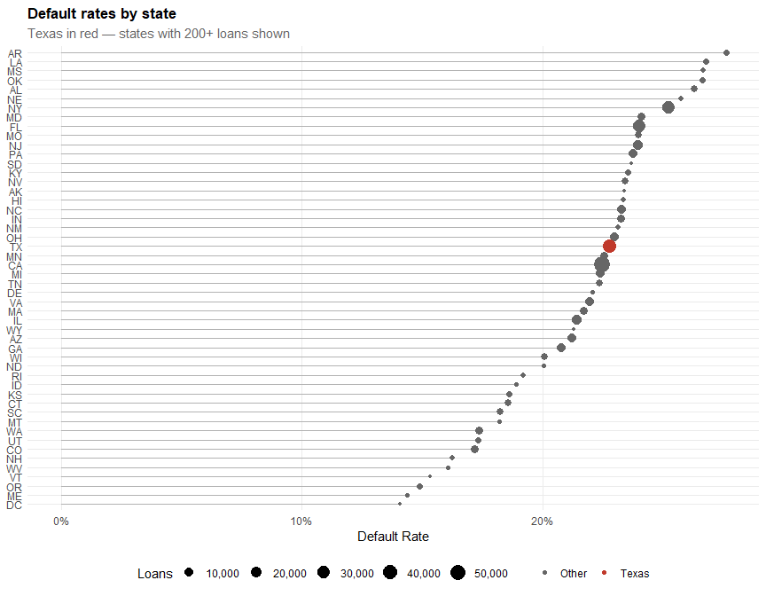
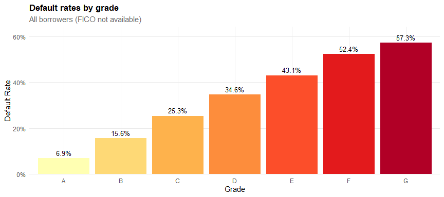

# 1. Loading and Cleaning

``` r
Loan_raw <- load_loan_data("data/Loan_Cred/loan_data.rds")
glue("Raw data: {nrow(Loan_raw)} loans across {ncol(Loan_raw)} columns")
```

    ## Raw data: 1000000 loans across 145 columns

The dataset has a lot of columns, many of which are mostly empty. We
clean by removing those, fixing formatting issues, and creating a clear
loan outcome label.

``` r
Loan_df <- Loan_raw %>%
    clean_names() %>%
    {if ("int_rate"   %in% names(.)) mutate(., int_rate   = clean_int_rate(int_rate))   else .} %>%
    {if ("emp_length" %in% names(.)) mutate(., emp_length = clean_emp_length(emp_length)) else .} %>%
    {if ("term"       %in% names(.)) mutate(., term       = clean_term(term))             else .} %>%
    drop_mostly_empty(cutoff = 0.80) %>%
    mutate(
        loan_outcome = classify_loan(loan_status),
        is_default   = as.integer(loan_outcome == "Default")
    )

glue("After cleaning: {nrow(Loan_df)} loans, {ncol(Loan_df)} columns")
```

    ## After cleaning: 1000000 loans, 108 columns

``` r
# find whichever FICO columns survived
fico_low  <- names(Loan_df)[str_detect(names(Loan_df), "fico.*low")][1]
fico_high <- names(Loan_df)[str_detect(names(Loan_df), "fico.*high")][1]

Loan_df <- Loan_df %>%
    mutate(
        fico_mid = if (!is.na(fico_low) & !is.na(fico_high))
            (.data[[fico_low]] + .data[[fico_high]]) / 2 else NA_real_,

        income_band = cut(annual_inc,
                          breaks = c(0, 30000, 50000, 75000, 100000, 150000, Inf),
                          labels = c("<30k","30-50k","50-75k","75-100k","100-150k","150k+")),

        dti_band = cut(dti, breaks = c(0, 10, 15, 20, 25, 30, Inf),
                       labels = c("<10","10-15","15-20","20-25","25-30","30+")),

        emp_group = case_when(
            is.na(emp_length) ~ "Unknown",
            emp_length == 0   ~ "<1 yr",
            emp_length <= 3   ~ "1-3 yrs",
            emp_length <= 5   ~ "4-5 yrs",
            emp_length <= 9   ~ "6-9 yrs",
            TRUE              ~ "10+ yrs"),

        term_label = if_else(term == 36, "36 months", "60 months")
    )
```

How the loans break down by outcome:

``` r
Loan_df %>%
    count(loan_outcome, sort = TRUE) %>%
    mutate(share = sprintf("%.1f%%", n / sum(n) * 100)) %>%
    kable(col.names = c("Outcome", "Count", "Share"), format = "pipe")
```

| Outcome    |  Count | Share |
|:-----------|-------:|:------|
| Current    | 597668 | 59.8% |
| Fully Paid | 297123 | 29.7% |
| Default    |  86079 | 8.6%  |
| Other      |  19130 | 1.9%  |

From here we focus on **closed loans only** (Fully Paid vs Default) so
the comparisons are fair.

``` r
closed <- Loan_df %>% filter(loan_outcome %in% c("Fully Paid", "Default"))
glue("{nrow(closed)} closed loans — overall default rate: {sprintf('%.1f%%', mean(closed$is_default)*100)}")
```

    ## 383202 closed loans — overall default rate: 22.5%

------------------------------------------------------------------------

# 2. What Drives Defaults?

We check default rates across the main borrower characteristics using
`map` to loop through them all at once.

``` r
vars_to_check <- c("grade", "purpose", "term_label",
                    "home_ownership", "emp_group", "income_band", "dti_band")

rate_tables <- vars_to_check %>%
    set_names() %>%
    map(~ default_rate_by(Loan_df, .x))
```

## Credit Grade

``` r
rate_tables$grade %>%
    ggplot(aes(x = grade, y = default_rate, fill = default_rate)) +
    geom_col(show.legend = FALSE) +
    geom_text(aes(label = sprintf("%.1f%%", default_rate*100)), vjust = -0.5, size = 3.5) +
    scale_y_continuous(labels = percent, expand = expansion(mult = c(0, 0.12))) +
    scale_fill_gradient(low = "#2C7A4B", high = "#C0392B") +
    labs(title = "Default rate by credit grade",
         subtitle = "Grade A borrowers are safest; risk climbs steadily toward G",
         x = "Grade", y = "Default Rate") +
    theme_q3()
```



Grades clearly separate good borrowers from risky ones — A-grade
borrowers default far less than F or G.

## Loan Purpose

``` r
rate_tables$purpose %>%
    filter(n_loans >= 100) %>%
    ggplot(aes(x = reorder(purpose, default_rate), y = default_rate)) +
    geom_col(fill = "#C0392B", alpha = 0.8) +
    geom_text(aes(label = sprintf("%.1f%%", default_rate*100)), hjust = -0.1, size = 3) +
    scale_y_continuous(labels = percent, expand = expansion(mult = c(0, 0.15))) +
    coord_flip() +
    labs(title = "Default rate by loan purpose",
         subtitle = "Small business loans are the riskiest by far",
         x = NULL, y = "Default Rate") +
    theme_q3()
```



## Loan Term and Home Ownership

``` r
p1 <- rate_tables$term_label %>%
    ggplot(aes(x = term_label, y = default_rate, fill = term_label)) +
    geom_col(show.legend = FALSE) +
    geom_text(aes(label = sprintf("%.1f%%", default_rate*100)), vjust = -0.5, size = 3.5) +
    scale_y_continuous(labels = percent, expand = expansion(mult = c(0,0.15))) +
    scale_fill_manual(values = c("#2980B9","#E74C3C")) +
    labs(title = "By loan term", x = NULL, y = "Default Rate") + theme_q3()

p2 <- rate_tables$home_ownership %>%
    filter(n_loans >= 100) %>%
    ggplot(aes(x = reorder(home_ownership, default_rate), y = default_rate)) +
    geom_col(fill = "#8E44AD", alpha = 0.75) +
    geom_text(aes(label = sprintf("%.1f%%", default_rate*100)), vjust = -0.5, size = 3.5) +
    scale_y_continuous(labels = percent, expand = expansion(mult = c(0,0.15))) +
    labs(title = "By home ownership", x = NULL, y = NULL) + theme_q3()

p1 + p2
```



60-month loans default more than 36-month ones. Renters default a bit
more than homeowners, but the gap is small.

## Income and DTI

``` r
p3 <- rate_tables$income_band %>%
    filter(n_loans >= 50) %>%
    ggplot(aes(x = income_band, y = default_rate)) +
    geom_col(fill = "#27AE60", alpha = 0.8) +
    geom_text(aes(label = sprintf("%.1f%%", default_rate*100)), vjust = -0.5, size = 3) +
    scale_y_continuous(labels = percent, expand = expansion(mult = c(0,0.12))) +
    labs(title = "By income band", x = NULL, y = "Default Rate") + theme_q3()

p4 <- rate_tables$dti_band %>%
    filter(n_loans >= 50) %>%
    ggplot(aes(x = dti_band, y = default_rate)) +
    geom_col(fill = "#E67E22", alpha = 0.8) +
    geom_text(aes(label = sprintf("%.1f%%", default_rate*100)), vjust = -0.5, size = 3) +
    scale_y_continuous(labels = percent, expand = expansion(mult = c(0,0.12))) +
    labs(title = "By DTI band", x = NULL, y = NULL) + theme_q3()

p3 + p4
```



Lower income and higher DTI both push default rates up — as expected.

------------------------------------------------------------------------

# 3. Who Defaults Most?

Putting it all together, the riskiest borrower profile looks like this:

``` r
tibble(
    Factor = c("Credit Grade", "Loan Purpose", "Loan Term",
               "Income", "DTI", "Home Ownership"),
    `Highest Default Risk` = c(
        "Grade F / G",
        "Small business loans",
        "60-month (long term)",
        "Below $30k",
        "Above 25",
        "Renters (slightly higher)")
) %>%
    kable(format = "pipe")
```

| Factor         | Highest Default Risk      |
|:---------------|:--------------------------|
| Credit Grade   | Grade F / G               |
| Loan Purpose   | Small business loans      |
| Loan Term      | 60-month (long term)      |
| Income         | Below $30k                |
| DTI            | Above 25                  |
| Home Ownership | Renters (slightly higher) |

And if we look at interest rate — borrowers paying higher rates are more
likely to default:

``` r
closed %>%
    mutate(rate_band = cut(int_rate, breaks = seq(4, 28, by = 3), include.lowest = TRUE)) %>%
    filter(!is.na(rate_band)) %>%
    group_by(rate_band) %>%
    summarise(default_rate = mean(is_default), n = n(), .groups = "drop") %>%
    filter(n >= 30) %>%
    ggplot(aes(x = rate_band, y = default_rate, group = 1)) +
    geom_line(linewidth = 1, color = "#2980B9") +
    geom_point(size = 2.5, color = "#2980B9") +
    scale_y_continuous(labels = percent) +
    labs(title = "Default rate by interest rate",
         subtitle = "Higher rates correlate with more defaults",
         x = "Interest Rate Range (%)", y = "Default Rate") +
    theme_q3() +
    theme(axis.text.x = element_text(angle = 45, hjust = 1))
```



------------------------------------------------------------------------

# 4. DTI Hard-Cap: What Should It Be?

The Director wants a recommended Debt-to-Income (DTI) cutoff. Let’s look
at how default rate changes as DTI rises.

``` r
dti_curve <- closed %>%
    filter(!is.na(dti)) %>%
    mutate(dti_bin = cut(dti, breaks = seq(0, 40, by = 2), include.lowest = TRUE)) %>%
    group_by(dti_bin) %>%
    summarise(default_rate = mean(is_default), n = n(), .groups = "drop") %>%
    filter(n >= 30)

dti_curve %>%
    ggplot(aes(x = dti_bin, y = default_rate, group = 1)) +
    geom_line(linewidth = 1, color = "#2980B9") +
    geom_point(size = 2.5, color = "#2980B9") +
    scale_y_continuous(labels = percent) +
    labs(title = "Default rate by DTI",
         subtitle = "Risk picks up noticeably above DTI of ~25",
         x = "DTI Range", y = "Default Rate") +
    theme_q3() +
    theme(axis.text.x = element_text(angle = 45, hjust = 1))
```



Suggested caps depending on how much risk the Institute is willing to
accept:

``` r
tolerances <- c(0.12, 0.15, 0.18, 0.20)

dti_caps <- map_dfr(tolerances, function(tol) {
    cap <- dti_curve %>%
        filter(default_rate <= tol) %>%
        pull(dti_bin) %>%
        as.character() %>%
        str_extract("\\d+(?=\\])") %>%
        as.numeric() %>%
        max(na.rm = TRUE)
    tibble(`Risk tolerance` = sprintf("%.0f%%", tol*100),
           `Suggested DTI cap` = cap)
})

dti_caps %>% kable(format = "pipe")
```

| Risk tolerance | Suggested DTI cap |
|:---------------|------------------:|
| 12%            |              -Inf |
| 15%            |              -Inf |
| 18%            |                12 |
| 20%            |                16 |

## Does it differ by state?

``` r
closed %>%
    filter(!is.na(dti)) %>%
    mutate(region = if_else(addr_state == "TX", "Texas", "Other States"),
           dti_bin = cut(dti, breaks = seq(0, 40, by = 3), include.lowest = TRUE)) %>%
    group_by(dti_bin, region) %>%
    summarise(default_rate = mean(is_default), n = n(), .groups = "drop") %>%
    filter(n >= 20) %>%
    ggplot(aes(x = dti_bin, y = default_rate, color = region, group = region)) +
    geom_line(linewidth = 1) + geom_point(size = 2) +
    scale_color_manual(values = c("Texas" = "#C0392B", "Other States" = "#2980B9")) +
    scale_y_continuous(labels = percent) +
    labs(title = "DTI vs Default: Texas compared to the rest",
         x = "DTI Range", y = "Default Rate", color = NULL) +
    theme_q3() +
    theme(axis.text.x = element_text(angle = 45, hjust = 1))
```



Texas follows the same pattern as the rest of the country, so a single
national DTI cap is reasonable.

------------------------------------------------------------------------

# 5. Is Texas Different?

``` r
closed %>%
    mutate(region = if_else(addr_state == "TX", "Texas", "Other States")) %>%
    group_by(region) %>%
    summarise(
        Loans = n(),
        `Default Rate` = sprintf("%.1f%%", mean(is_default)*100),
        `Avg Loan` = sprintf("$%s", comma(round(mean(loan_amnt)))),
        `Avg Income` = sprintf("$%s", comma(round(mean(annual_inc)))),
        `Avg DTI` = round(mean(dti, na.rm = TRUE), 1),
        `Avg Interest Rate` = sprintf("%.1f%%", mean(int_rate, na.rm = TRUE)),
        .groups = "drop"
    ) %>%
    kable(format = "pipe")
```

| region       |  Loans | Default Rate | Avg Loan | Avg Income | Avg DTI | Avg Interest Rate |
|:-----------|------:|:-----------|:--------|:---------|-------:|:---------------|
| Other States | 350819 | 22.4%        | $14,486  | $78,440    |    18.7 | 13.0%             |
| Texas        |  32383 | 22.8%        | $15,184  | $83,450    |    19.8 | 13.0%             |

``` r
tx <- closed %>% mutate(is_tx = addr_state == "TX")
ptest <- prop.test(
    x = c(sum(tx$is_default[tx$is_tx]), sum(tx$is_default[!tx$is_tx])),
    n = c(sum(tx$is_tx), sum(!tx$is_tx))
)
```

Proportion test p-value: **0.151**. Texas is **not significantly
different** from the national average.

## How do all states compare?

``` r
closed %>%
    group_by(addr_state) %>%
    summarise(n = n(), default_rate = mean(is_default), .groups = "drop") %>%
    filter(n >= 200) %>%
    mutate(is_tx = addr_state == "TX") %>%
    ggplot(aes(x = reorder(addr_state, default_rate), y = default_rate)) +
    geom_segment(aes(xend = reorder(addr_state, default_rate),
                     y = 0, yend = default_rate), color = "grey70") +
    geom_point(aes(color = is_tx, size = n)) +
    scale_color_manual(values = c("grey40", "#C0392B"),
                       labels = c("Other", "Texas"), name = NULL) +
    scale_size_continuous(name = "Loans", labels = comma) +
    scale_y_continuous(labels = percent) +
    coord_flip() +
    labs(title = "Default rates by state",
         subtitle = "Texas in red — states with 200+ loans shown",
         x = NULL, y = "Default Rate") +
    theme_q3()
```



------------------------------------------------------------------------

# 6. Testing the Institute’s Beliefs

The Institute holds three long-standing beliefs. Let’s check them
against the data.

## Belief 1: Homeowners employed 10+ years default less on short-term loans

``` r
closed %>%
    filter(term == 36) %>%
    mutate(group = case_when(
        home_ownership %in% c("OWN","MORTGAGE") & emp_length >= 10 ~ "Homeowner & 10+ yrs",
        TRUE ~ "Everyone else"
    )) %>%
    group_by(group) %>%
    summarise(Loans = n(),
              `Default Rate` = sprintf("%.1f%%", mean(is_default)*100),
              .groups = "drop") %>%
    kable(format = "pipe")
```

| group               |  Loans | Default Rate |
|:--------------------|-------:|:-------------|
| Everyone else       | 228821 | 20.3%        |
| Homeowner & 10+ yrs |  68636 | 14.6%        |

There is a gap, but it’s modest. Homeownership and long employment help
a bit — they’re not a silver bullet though. **Partially supported.**

## Belief 2: States differ significantly on short-term defaults

``` r
h2_data <- closed %>% filter(term == 36)
h2_test <- chisq.test(table(h2_data$addr_state, h2_data$is_default),
                       simulate.p.value = TRUE)
```

Chi-squared p-value: **0.0004998** — this is **significant, so yes,
states do differ. Supported.**

## Belief 3: Credit grades predict defaults well for younger borrowers

We look at borrowers with lower FICO scores (below 680) as a proxy for
less established credit histories.

``` r
has_fico <- "fico_mid" %in% names(closed) && !all(is.na(closed$fico_mid))

if (has_fico) {
    h3 <- closed %>% filter(fico_mid < 680)
    h3_sub <- "Borrowers with FICO < 680"
} else {
    h3 <- closed
    h3_sub <- "All borrowers (FICO not available)"
}

h3 %>%
    group_by(grade) %>%
    summarise(default_rate = mean(is_default), n = n(), .groups = "drop") %>%
    ggplot(aes(x = grade, y = default_rate, fill = grade)) +
    geom_col(show.legend = FALSE) +
    geom_text(aes(label = sprintf("%.1f%%", default_rate*100)), vjust = -0.5, size = 3.5) +
    scale_y_continuous(labels = percent, expand = expansion(mult = c(0, 0.12))) +
    scale_fill_brewer(palette = "YlOrRd") +
    labs(title = "Default rates by grade", subtitle = h3_sub,
         x = "Grade", y = "Default Rate") +
    theme_q3()
```



Clear step-up from A to G — credit grades do a good job separating risk.
**Supported.**

## Summary of beliefs

``` r
tibble(
    Belief = c(
        "Homeowners + 10yr employment default less (short-term)",
        "States differ on short-term defaults",
        "Credit grades predict default for younger borrowers"
    ),
    Verdict = c(
        "Partially supported — small difference",
        if_else(h2_test$p.value < 0.05, "Supported", "Not supported"),
        "Supported — clear pattern across grades"
    )
) %>% kable(format = "pipe")
```

| Belief | Verdict |
|:----------------------------------------|:------------------------------|
| Homeowners + 10yr employment default less (short-term) | Partially supported — small difference |
| States differ on short-term defaults | Supported |
| Credit grades predict default for younger borrowers | Supported — clear pattern across grades |

------------------------------------------------------------------------

# 7. Recommendations for the Director

Based on the analysis, here are the main takeaways:

**On DTI caps:** A DTI hard-cap between 25 and 30 makes sense. Above 30,
defaults rise sharply. A single national cap works — no need for
state-specific thresholds.

**On who defaults:** The riskiest borrowers tend to have lower credit
grades (D–G), take out small business loans, borrow for 60 months, and
have high DTI or low income. These factors matter more than home
ownership or employment length.

**On credit grades:** The grading system works well. But it’s even
better when paired with DTI and FICO checks, especially for borderline
grades like C and D.

**On interest rates:** Borrowers paying very high interest rates are the
most likely to default. It’s worth asking whether charging risky
borrowers more might actually make them more likely to fail.

**On Texas:** Texas is broadly in line with national patterns — no
special treatment needed.

**On the Institute’s beliefs:** Two out of three hold up. Homeownership
and employment length help, but less than the Institute thinks. Credit
grades and state-level differences are real.
