# Introduction

Netflix has experienced a decline in subscribers and share price in
recent times. In this report we explore the Netflix content catalogue to
understand what types of content dominate the platform, how ratings and
movie lengths differ across countries and genres, and what themes emerge
from movie descriptions.

We work with three datasets:

- **Titles**: All Netflix shows and movies with IMDb/TMDB scores,
  genres, countries and run-time.
- **Movie_Info**: Netflix movies specifically, with directors, cast, age
  ratings and duration.
- **Credits**: Actor and character information linked to titles.

# Data Loading & Preparation

``` r
# Load all three datasets using our sourced helper functions
Titles <- load_titles("data/netflix/titles.rds")
Movie_Info <- load_movie_info("data/netflix/netflix_movies.csv")
Credits <- load_credits("data/netflix/credits.rds")
```

# Content Overview

## Movies vs Shows

``` r
# Count content types
type_counts <- Titles %>%
    count_top_n(type, n = 5)

# Simple bar chart
ggplot(type_counts, aes(x = reorder(type, n), y = n, fill = type)) +
    geom_col(show.legend = FALSE) +
    geom_text(aes(label = n), hjust = -0.2, size = 4) +
    coord_flip() +
    labs(title = "Netflix Content: Movies vs Shows",
         x = NULL, y = "Number of Titles") +
    theme_minimal() +
    scale_fill_manual(values = c("MOVIE" = "#E50914", "SHOW" = "#564d4d"))
```

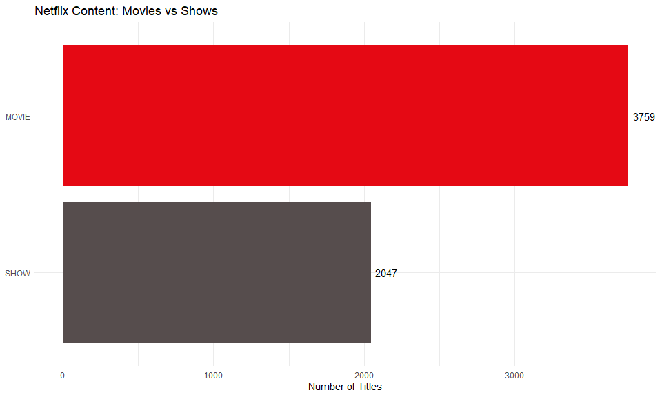

- Netflix’s catalogue is heavily **movie-dominated**, which makes sense
  given movies are cheaper to license per title than multi-season shows.

## Release Year Trends

``` r
# Titles per year, split by type
Titles %>%
    filter(release_year >= 1990) %>%
    count(release_year, type) %>%
    ggplot(aes(x = release_year, y = n, colour = type)) +
    geom_line(linewidth = 1) +
    geom_point(size = 1.2, alpha = 0.6) +
    labs(title = "Number of Titles by Release Year (post-1990)",
         x = "Release Year", y = "Count", colour = "Type") +
    theme_minimal() +
    scale_colour_manual(values = c("MOVIE" = "#E50914", "SHOW" = "#221f1f"))
```

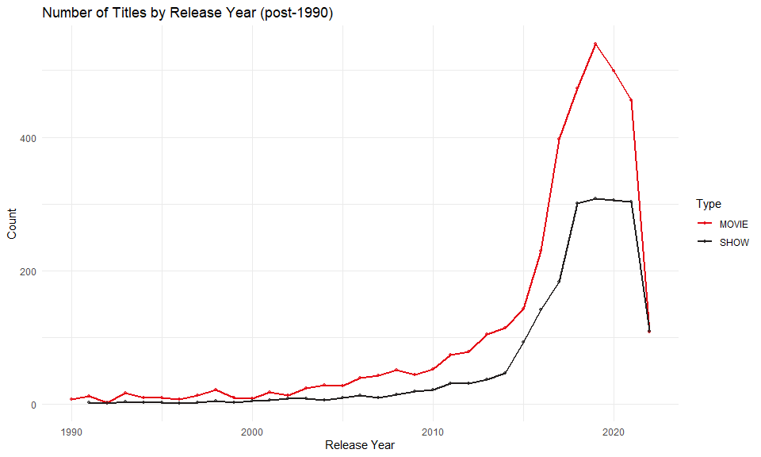

- Content additions ramp up sharply from around 2015, peaking in the
  late 2010s before levelling off , reflecting Netflix’s massive
  investment in original content during that period.

# Country Analysis

## Top Producing Countries

``` r
# Explode countries and count
country_counts <- Titles %>%
    explode_countries() %>%
    count_top_n(country, n = 15)

ggplot(country_counts, aes(x = reorder(country, n), y = n)) +
    geom_col(fill = "#E50914") +
    coord_flip() +
    labs(title = "Top 15 Content-Producing Countries on Netflix",
         x = NULL, y = "Number of Titles") +
    theme_minimal()
```

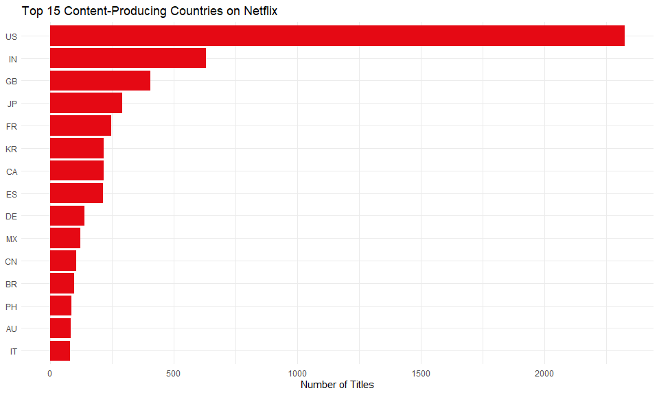

- The **US** dominates by a massive margin, followed by **India** and
  the **UK**. This is expected given Netflix’s origins and the size of
  Hollywood and Bollywood.

## Genre Preferences by Country (Top 5 Countries)

``` r
top5_countries <- country_counts %>% slice_head(n = 5) %>% pull(country)

Titles %>%
    explode_countries() %>%
    filter(country %in% top5_countries) %>%
    explode_genres() %>%
    count(country, genre, sort = TRUE) %>%
    group_by(country) %>%
    slice_head(n = 5) %>%
    ungroup() %>%
    ggplot(aes(x = reorder_within(genre, n, country), y = n, fill = country)) +
    geom_col(show.legend = FALSE) +
    facet_wrap(~country, scales = "free_y", ncol = 1) +
    coord_flip() +
    scale_x_reordered() +
    labs(title = "Top 5 Genres in Each of the Top 5 Producing Countries",
         x = NULL, y = "Count") +
    theme_minimal() +
    scale_fill_brewer(palette = "Set1")
```

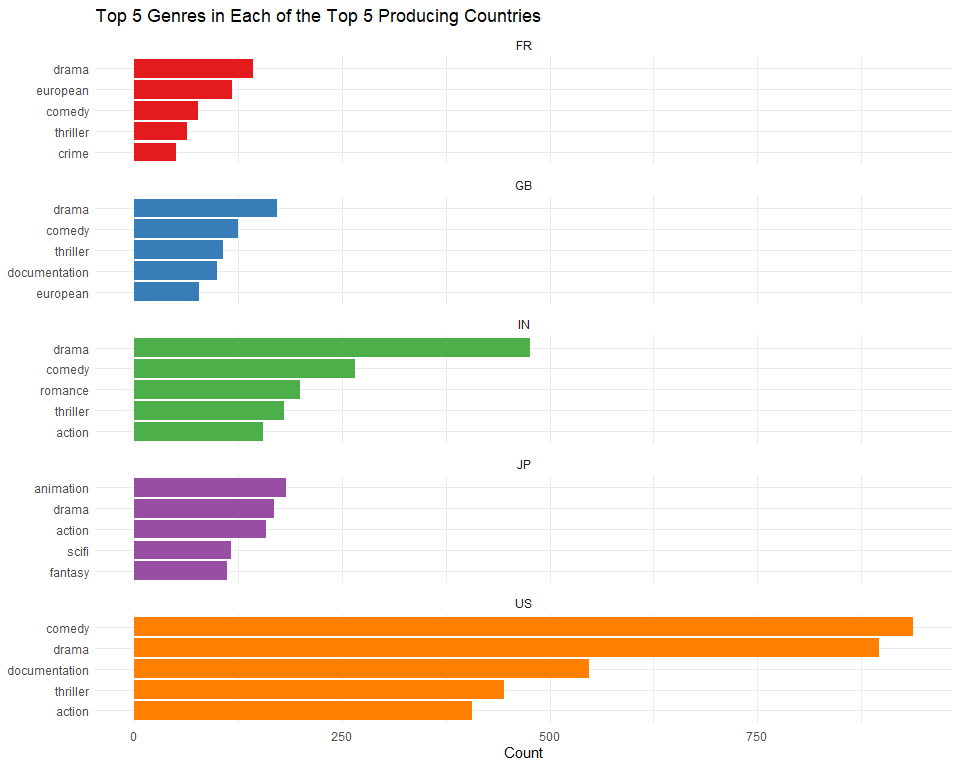

- **Drama** and **comedy** consistently appear across all major
  countries. **India** and **Great Britain** shows a strong preference
  for drama and comedy, while **Japan** leans towards animation and
  drama.

# Genre Analysis

## Most Popular Genres

``` r
genre_counts <- Titles %>%
    explode_genres() %>%
    count_top_n(genre, n = 12)

ggplot(genre_counts, aes(x = reorder(genre, n), y = n)) +
    geom_col(fill = "#831010") +
    geom_text(aes(label = n), hjust = -0.15, size = 3.5) +
    coord_flip() +
    labs(title = "Most Common Genres on Netflix",
         x = NULL, y = "Number of Titles") +
    theme_minimal()
```

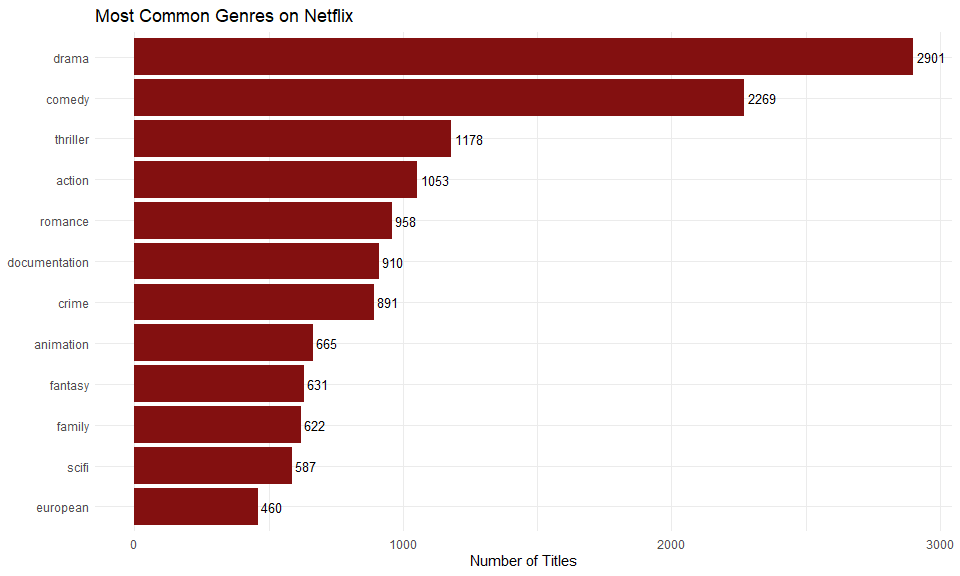

- **Drama** is by far the most common genre, followed by **comedy** and
  **action**. This suggests investors should prioritise drama content
  when building a catalogue.

## Genre Trends Over Time

``` r
top6_genres <- genre_counts %>% slice_head(n = 6) %>% pull(genre)

Titles %>%
    explode_genres() %>%
    filter(genre %in% top6_genres, release_year >= 2000) %>%
    count(release_year, genre) %>%
    ggplot(aes(x = release_year, y = n, colour = genre)) +
    geom_line(linewidth = 1) +
    labs(title = "Genre Trends Over Time (Top 6 Genres, post-2000)",
         x = "Release Year", y = "Count", colour = "Genre") +
    theme_minimal() +
    scale_colour_brewer(palette = "Set2")
```

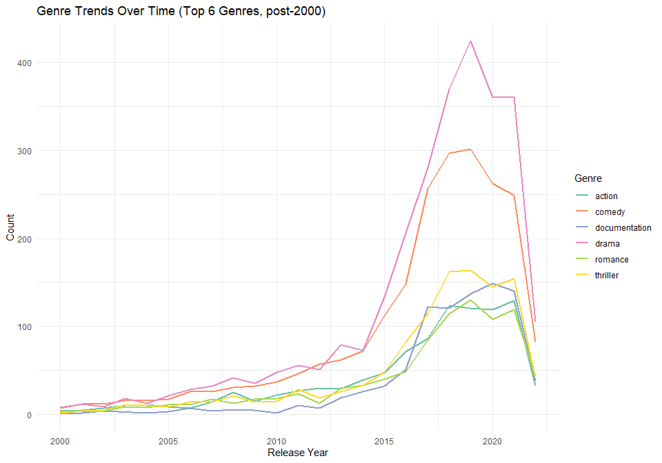

- All genres see exponential growth from ~2015 onwards. **Drama**
  consistently leads. **Documentation** (documentaries) has also seen a
  strong rise, suggesting growing viewer appetite for non-fiction
  content.

# Ratings & Scores

## IMDb Score Distribution

``` r
Titles %>%
    filter(!is.na(imdb_score)) %>%
    ggplot(aes(x = imdb_score)) +
    geom_histogram(binwidth = 0.3, fill = "#E50914", colour = "white", alpha = 0.85) +
    geom_vline(aes(xintercept = median(imdb_score, na.rm = TRUE)),
               linetype = "dashed", colour = "black", linewidth = 0.8) +
    labs(title = "Distribution of IMDb Scores Across Netflix Titles",
         subtitle = "Dashed line = median score",
         x = "IMDb Score", y = "Count") +
    theme_minimal()
```

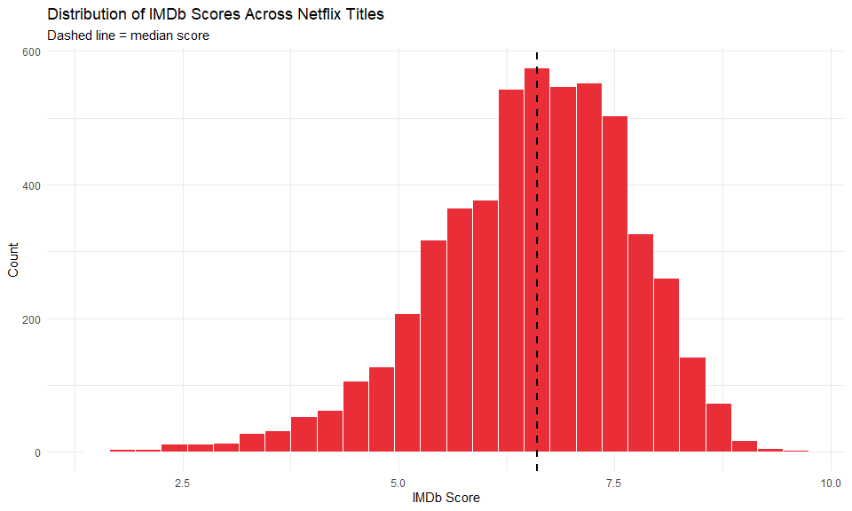

- Scores are roughly normally distributed and centre around 6-7, with
  relatively few titles scoring above 8. The platform carries a mix of
  quality and not everything is a hit.

## IMDb Scores by Genre

``` r
Titles %>%
    explode_genres() %>%
    filter(genre %in% top6_genres, !is.na(imdb_score)) %>%
    ggplot(aes(x = reorder(genre, imdb_score, FUN = median), y = imdb_score, fill = genre)) +
    geom_boxplot(show.legend = FALSE, alpha = 0.8) +
    coord_flip() +
    labs(title = "IMDb Score Distribution by Genre (Top 6)",
         x = NULL, y = "IMDb Score") +
    theme_minimal() +
    scale_fill_brewer(palette = "Set2")
```

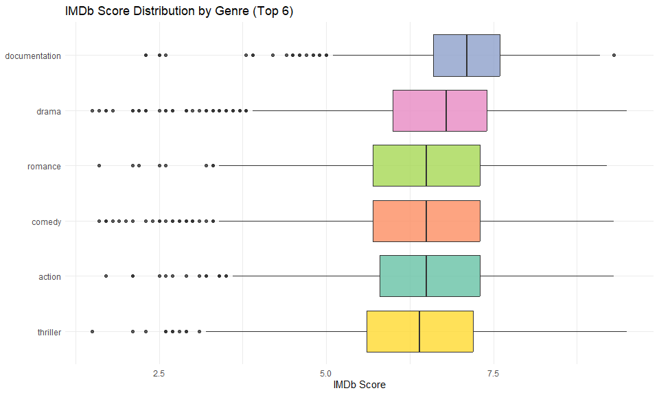

- **Documentation** (documentaries) tend to score slightly higher on
  average, while **action** and **comedy** show wider variance. This
  suggests documentaries are a safer bet quality-wise.

## Scores by Country (Top 10)

``` r
top10_countries <- country_counts %>% slice_head(n = 10) %>% pull(country)

Titles %>%
    explode_countries() %>%
    filter(country %in% top10_countries, !is.na(imdb_score)) %>%
    ggplot(aes(x = reorder(country, imdb_score, FUN = median), y = imdb_score, fill = country)) +
    geom_boxplot(show.legend = FALSE, alpha = 0.8) +
    coord_flip() +
    labs(title = "IMDb Score Distribution by Country (Top 10 Producing Countries)",
         x = NULL, y = "IMDb Score") +
    theme_minimal()
```

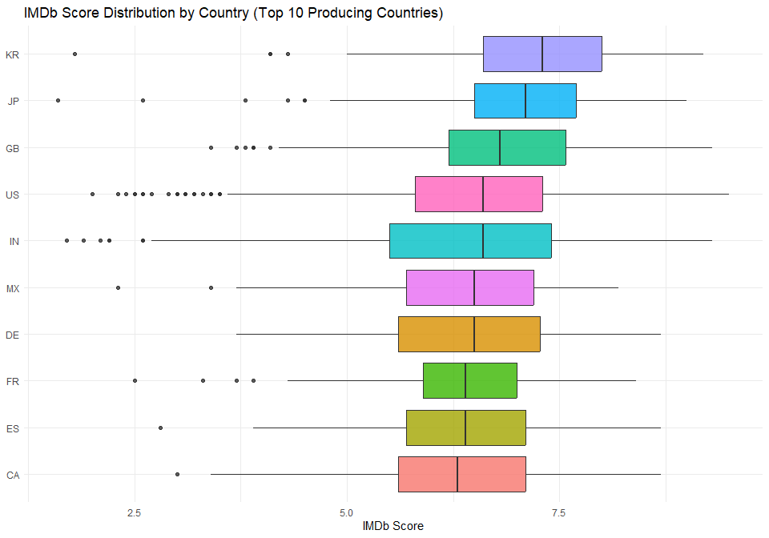

- Countries like the **Korea Republic** tend to produce higher-rated
  content on average, while **India’s** larger volume comes with a wider
  spread of quality.

## Age Certification Breakdown

``` r
Titles %>%
    filter(!is.na(age_certification), age_certification != "") %>%
    count_top_n(age_certification, n = 10) %>%
    ggplot(aes(x = reorder(age_certification, n), y = n)) +
    geom_col(fill = "#564d4d") +
    coord_flip() +
    labs(title = "Content by Age Certification",
         x = NULL, y = "Count") +
    theme_minimal()
```

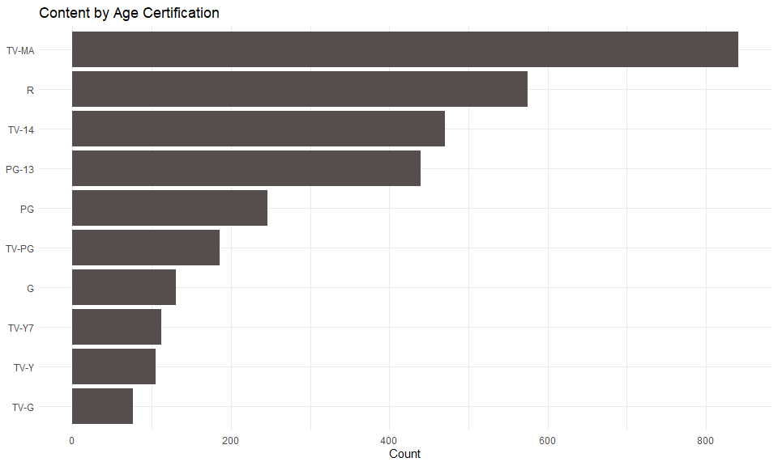

- A large portion of content is rated **R** or **TV-MA**, indicating
  Netflix skews towards adult-oriented content. Investors wanting a
  family-friendly platform would need to fill a different niche.

# Movie Length Analysis

## Distribution of Movie Runtimes

``` r
# Filter to movies only and remove extreme outliers
movies_only <- Titles %>%
    filter(type == "MOVIE", !is.na(runtime), runtime > 0, runtime < 300)

ggplot(movies_only, aes(x = runtime)) +
    geom_histogram(binwidth = 5, fill = "#E50914", colour = "white", alpha = 0.85) +
    geom_vline(aes(xintercept = median(runtime)),
               linetype = "dashed", colour = "black", linewidth = 0.8) +
    labs(title = "Distribution of Movie Runtimes on Netflix",
         subtitle = "Dashed line = median",
         x = "Runtime (minutes)", y = "Count") +
    theme_minimal()
```

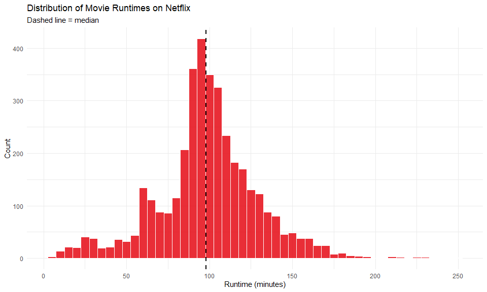

- The typical Netflix movie is around **90-100 minutes** long. There’s a
  nice bell-shaped distribution with a slight right tail from longer
  epic-style movies.

## Run-time by Genre

``` r
Titles %>%
    filter(type == "MOVIE", !is.na(runtime), runtime > 0, runtime < 300) %>%
    explode_genres() %>%
    filter(genre %in% top6_genres) %>%
    ggplot(aes(x = reorder(genre, runtime, FUN = median), y = runtime, fill = genre)) +
    geom_boxplot(show.legend = FALSE, alpha = 0.8) +
    coord_flip() +
    labs(title = "Movie Runtime by Genre",
         x = NULL, y = "Runtime (minutes)") +
    theme_minimal() +
    scale_fill_brewer(palette = "Set2")
```

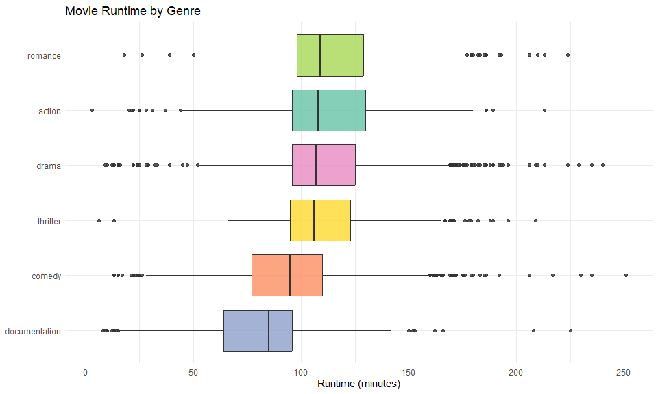

- **Drama** and **action** movies tend to be the longest. **Comedy** and
  **animation** typically run shorter. This has cost implications,
  longer movies mean more production hours.

## Average Run-time Over Time

``` r
movies_only %>%
    filter(release_year >= 1980) %>%
    group_by(release_year) %>%
    summarise(avg_runtime = mean(runtime, na.rm = TRUE), .groups = "drop") %>%
    ggplot(aes(x = release_year, y = avg_runtime)) +
    geom_point(alpha = 0.5, colour = "#E50914") +
    geom_smooth(method = "loess", se = TRUE, colour = "black", linewidth = 0.8) +
    labs(title = "Average Movie Runtime Over Time",
         x = "Release Year", y = "Average Runtime (min)") +
    theme_minimal()
```

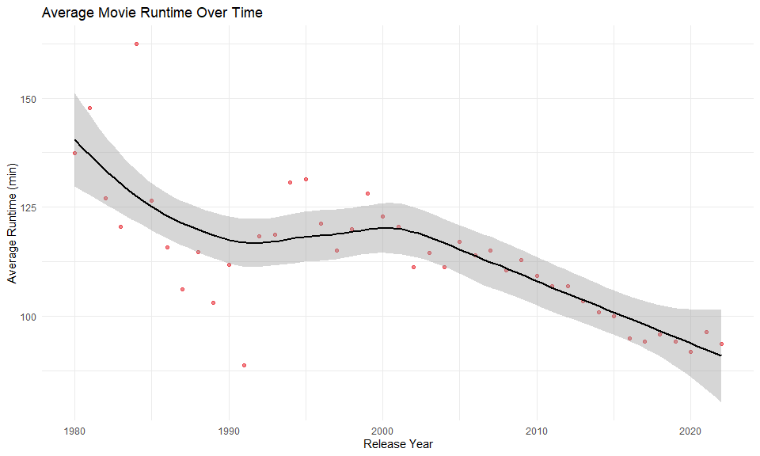

- There’s a slight **decline** in average run-time in recent years,
  suggesting a trend towards shorter, more digestible content — likely
  influenced by streaming habits where viewers have shorter attention
  spans.

# Netflix Movies Deep Dive

## Duration Distribution

``` r
Movie_Info %>%
    filter(!is.na(duration_mins), duration_mins > 0, duration_mins < 300) %>%
    ggplot(aes(x = duration_mins)) +
    geom_histogram(binwidth = 5, fill = "#831010", colour = "white", alpha = 0.85) +
    labs(title = "Duration of Netflix Movies (Movie_Info Dataset)",
         x = "Duration (minutes)", y = "Count") +
    theme_minimal()
```

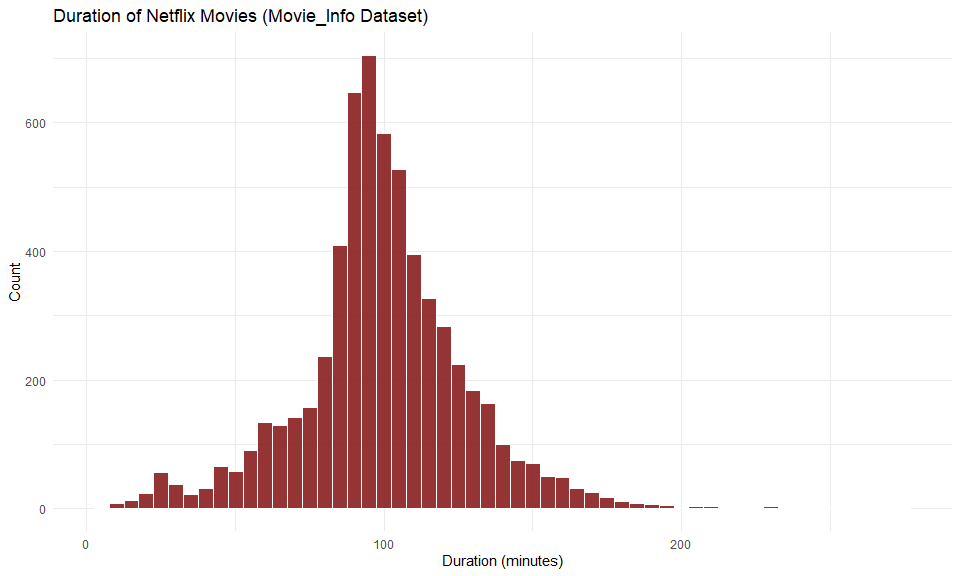

## Top Movie Categories

``` r
Movie_Info %>%
    explode_listed_in() %>%
    count_top_n(category, n = 12) %>%
    ggplot(aes(x = reorder(category, n), y = n)) +
    geom_col(fill = "#E50914") +
    coord_flip() +
    labs(title = "Most Common Movie Categories on Netflix",
         subtitle = "From the listed_in column in Movie_Info",
         x = NULL, y = "Count") +
    theme_minimal()
```

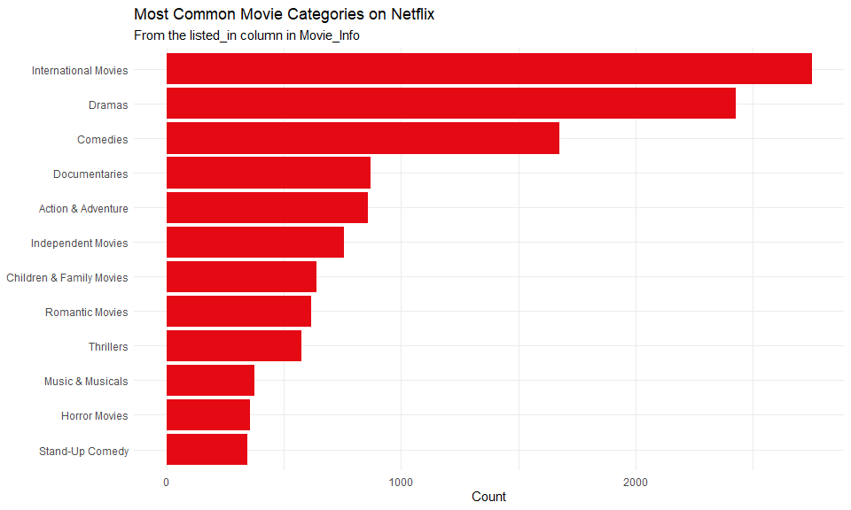

- **International Movies**, **Dramas**, and **Comedies** lead the pack.
  Netflix clearly invests heavily in international content to serve its
  global audience.

## Top Countries

``` r
# Split the country column (comma-separated)
Movie_Info %>%
    separate_rows(country, sep = ",\\s*") %>%
    mutate(country = str_trim(country)) %>%
    filter(!is.na(country), country != "") %>%
    count_top_n(country, n = 10) %>%
    ggplot(aes(x = reorder(country, n), y = n)) +
    geom_col(fill = "#564d4d") +
    coord_flip() +
    labs(title = "Top 10 Countries Producing Netflix Movies",
         x = NULL, y = "Count") +
    theme_minimal()
```

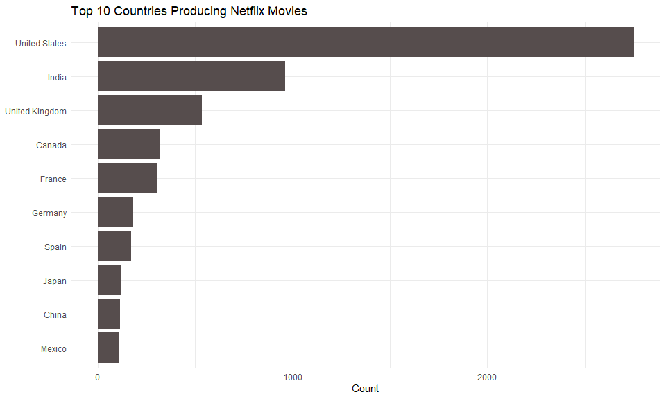

# Textual Analysis of Descriptions

We now look at the most common words used in Netflix movie descriptions
to see what themes and topics dominate the platform.

## Word Frequencies (Titles Descriptions)

``` r
# Use our functional text pipeline from the helper functions
word_freq <- Titles %>%
    filter(type == "MOVIE") %>%
    pull(description) %>%
    get_word_freq(n = 25)

ggplot(word_freq, aes(x = reorder(word, n), y = n)) +
    geom_col(fill = "#E50914") +
    coord_flip() +
    labs(title = "Most Common Words in Netflix Movie Descriptions",
         subtitle = "Stop words removed",
         x = NULL, y = "Frequency") +
    theme_minimal()
```

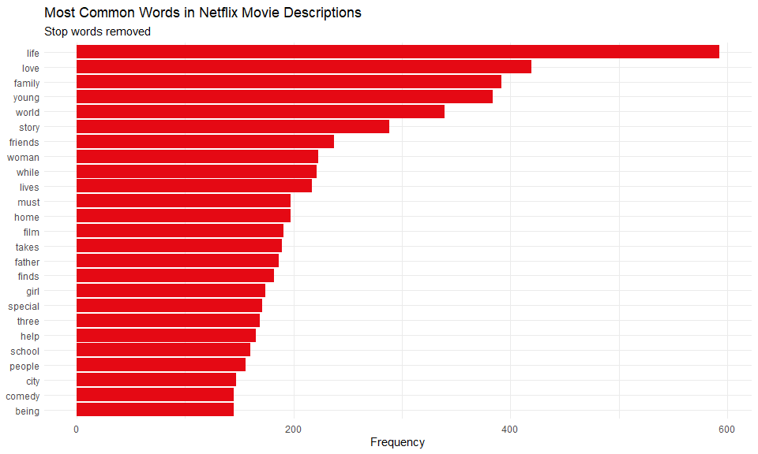

- Words like **“life”**, **“family”**, **“love”**, **“world”** and
  **“young”** dominate in titles. This tells us Netflix movies heavily
  revolve around relatable, human-centric themes and stories about
  people navigating life, relationships and coming-of-age.

## Word Frequencies by Type (Movie vs Show)

``` r
# Use map to get word frequencies for each type
word_by_type <- Titles %>%
    split(.$type) %>%
    map(~.x %>% pull(description) %>% get_word_freq(n = 15)) %>%
    imap_dfr(~.x %>% mutate(type = .y))

ggplot(word_by_type, aes(x = reorder_within(word, n, type), y = n, fill = type)) +
    geom_col(show.legend = FALSE) +
    facet_wrap(~type, scales = "free") +
    coord_flip() +
    scale_x_reordered() +
    labs(title = "Top Words in Descriptions: Movies vs Shows",
         x = NULL, y = "Frequency") +
    theme_minimal() +
    scale_fill_manual(values = c("MOVIE" = "#E50914", "SHOW" = "#564d4d"))
```

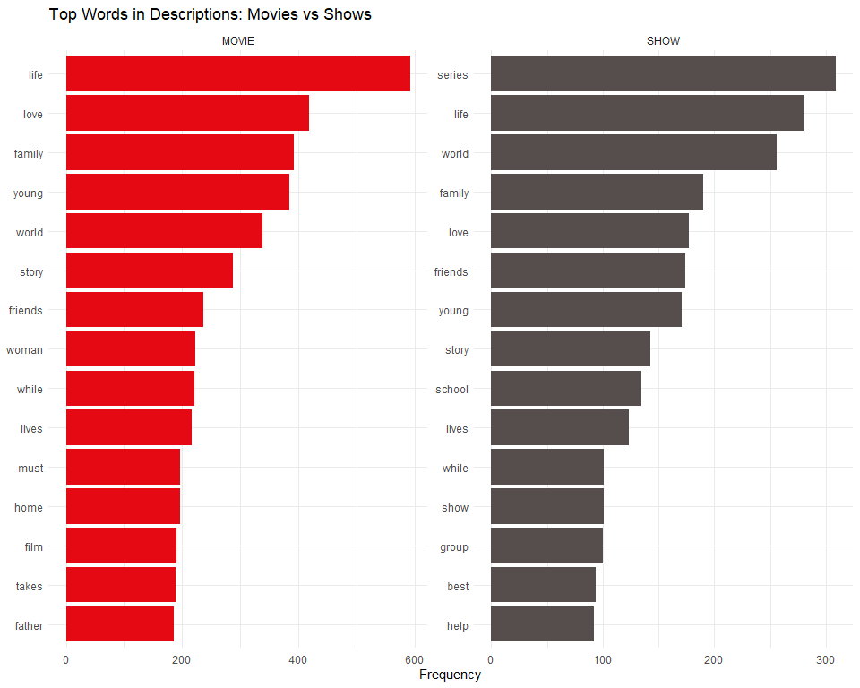

- Movies tend to focus more on individual stories (“life”, “young”,
  “love”), while shows lean towards group dynamics and ongoing
  narratives (“group”, “series”, “team”).

# Notable Actors & Directors

## Most Prolific Actors on Netflix

``` r
# Filter to actors only and count appearances
top_actors <- Credits %>%
    filter(role == "ACTOR") %>%
    count_top_n(name, n = 15)

ggplot(top_actors, aes(x = reorder(name, n), y = n)) +
    geom_col(fill = "#E50914") +
    coord_flip() +
    labs(title = "Top 15 Most Prolific Actors on Netflix",
         x = NULL, y = "Number of Titles") +
    theme_minimal()
```

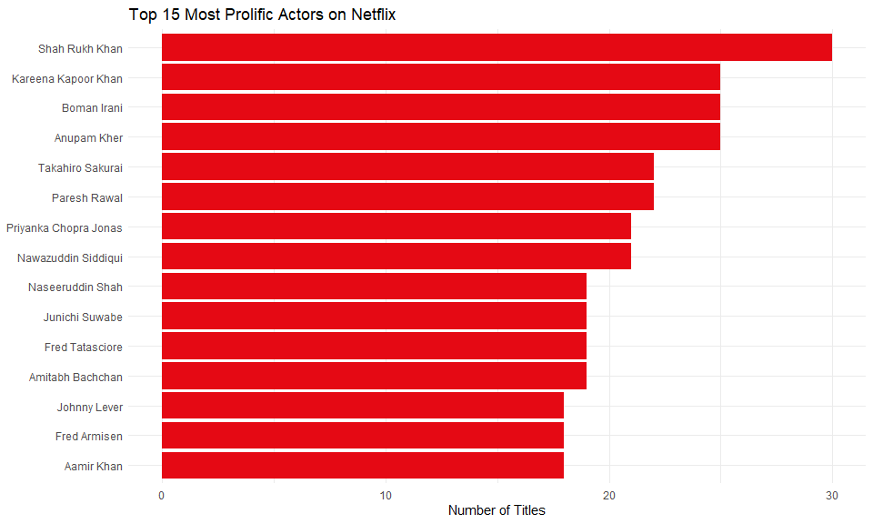

## Most Prolific Directors

``` r
top_directors <- Credits %>%
    filter(role == "DIRECTOR") %>%
    count_top_n(name, n = 15)

ggplot(top_directors, aes(x = reorder(name, n), y = n)) +
    geom_col(fill = "#831010") +
    coord_flip() +
    labs(title = "Top 15 Most Prolific Directors on Netflix",
         x = NULL, y = "Number of Titles") +
    theme_minimal()
```

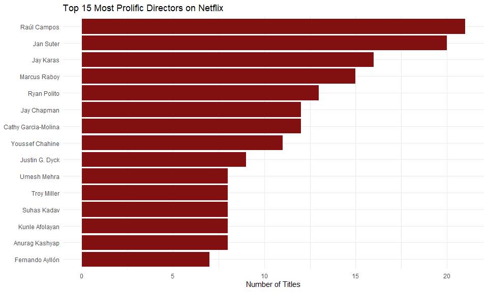

# Key Takeaways

Based on the analysis, here are the main insights for investors looking
to launch a competing streaming platform:

1.  **Content Mix**: Netflix is **movie-heavy**. A new platform could
    differentiate by investing more in original series, which build
    subscriber loyalty through ongoing engagement.

2.  **Geography**: The **US, India, and UK** dominate production.
    There’s room to tap into underrepresented markets (Africa, Southeast
    Asia, Latin America) where content demand is growing.

3.  **Genre Strategy**: **Drama** is king, but **documentaries**
    consistently score well and are cheaper to produce. Comedy and
    action have broad appeal but variable quality.

4.  **Quality**: The median IMDb score hovers around 6.5 , a lot of
    Netflix content is “average.” A quality-over-quantity strategy could
    be a competitive edge.

5.  **Movie Length**: Movies are trending **shorter**, reflecting
    streaming viewing habits. Content under 100 minutes tends to perform
    well. This can also be due to the recent rise in Tiktok and
    Instagram reels.

6.  **Themes**: Descriptions revolve around **life, family, love, and
    coming-of-age** stories. These universal themes have broad appeal
    across demographics.

7.  **Talent**: A few actors and directors appear repeatedly securing
    exclusive deals with prolific talent could drive viewership.
